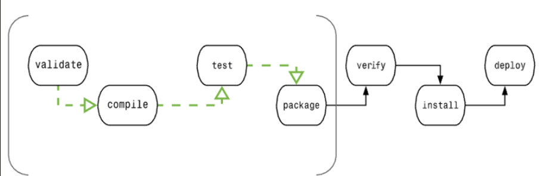

# 一、Maven项目结构

pom.xml

```
<?xml version="1.0" encoding="UTF-8"?>

<project 

    xmlns="http://maven.apache.org/POM/4.0.0"

    xmlns:xsi="http://www.w3.org/2001/XMLSchema-instance"

    xsi:schemaLocation="http://maven.apache.org/POM/4.0.0 http://maven.apache.org/xsd/maven-4.0.0.xsd">

  <modelVersion>4.0.0</modelVersion>


  <groupId>com</groupId>

  <artifactId>projext-java</artifactId>

  <version>1.0</version>

  <packaging>jar</packaging>


  <dependencies>

    <dependency>

      <groupId>junit</groupId>

      <artifactId>junit</artifactId>

      <version>4.12</version>

      <optional>true</optional>

    </dependency>

  </dependencies>


</project>
```

# 二、Maven项目构建
```
mvn compile  	#下载插件到本地Maven创库，编译代码（第一次编译会多一个文件夹

	

		clean		#清理

		test			#测试，日志报告 ./target/surefire-reports/

		package	#打包源文件为 .jar。执行以上命令。

		install		#安装到本地的Maven仓库，
```

# 三、Maven插件创建工程
```
●创建工程（在空目录创建工程）

mvn archetype: generate

-DgroupId={project-packaging}

-Dartifact Id=(project-name}

-DarchetypeArtifactId=maven-archetype-quickstart

-DinteractiveMode=false

●创建java工程（缺少resources文件夹）

mvn archetype:generate -DgroupId=com.itheima -DartifactId=java-project -DarchetypeArtifactId=maven-archetype-quickstart -Dversion=0.0.1-snapshot -DinteractiveMode=false

●创建web工程（缺少java文件夹）

mvn archetype:generate -DgroupId=com.itheima -DartifactId=web-project -

DarchetypeArtifactId=maven-archetype-webapp -Dversion=0.0.1-snapshot -

DinteractiveMode=false
```


# 四、依赖管理

1. 依赖传递
```
<!--  依赖传递
    1.路径优先，就近原则
    2.声明优先，在相同层级被依赖时，先配置的生效
    3.特殊优先，同级配置相同资源的版本，后置覆盖优先（依赖重复但是版本不同时
     对子类不显示，不继承-->

  <dependencies>
    <dependency>
      <groupId>junit</groupId>
      <artifactId>junit</artifactId>
      <version>3.8.1</version>
      
     <!-- 对子类不显示，不继承-->
      <optional>true</optional>

      <scope>test</scope>
    </dependency>
  </dependencies>
```
2. 排除依赖
```
  <dependencies>
    <dependency>
      <groupId>junit</groupId>
      <artifactId>junit</artifactId>
      <version>3.8.1</version>
<!--      对子类不显示，不继承-->
      <optional>true</optional>
      <scope>test</scope>
<!--      主动排除依赖的资源-->
      <exclusions>
        <exclusion>
          <groupId>org.hamcrest</groupId>
          <artifactId>hamcrest-core</artifactId>
        </exclusion>
      </exclusions>
      
    </dependency>
  </dependencies>
```

3. 依赖范围
```
<!--      依赖范围
        1.main文件夹范围
        2，test测试程序范围
        3.package指令范围

         依赖范围模式
        1.compile （ 1,2,3    例如：log4j
        2.test    （ 2        例如：junit
        3.provided（ 1,2      例如：servlet-api 服务器内置，打包会冲突
        4.runtime （ 3        例如：jdbc
        -->
      <scope>test</scope>

```

4. 依赖范围传递性
```
<!--      依赖范围的传递性
        1.compile，runtime可传递
        2.test，provided不可传递
-->
```

# 五、生命周期与插件

1.clean

2.default

3.site

4.生命周期在插件中的应用
```
<!--  构建-->
  <build>
    <finalName>WabiSabifag_Web</finalName>
<!--    插件-->
    <plugins>
      <plugin>
          <groupId>org.apache.tomcat.maven</groupId>
          <artifactId>tomcat7-maven-plugin</artifactId>
          <version>2.1</version>

<!--      生命周期和插件-->
        <executions>
          <execution>
            <goals>

<!--       打包为 jar -->
              <goal>jar</goal>
            </goals>

<!--        在该过程时将执行-->
            <phase>generate-test-resources</phase>

          </execution>
        </executions>


<!--        配置-->
        <configuration>
<!--          端口-->
          <port>8080</port>
<!--          路径-->
          <path>/</path>
        </configuration>
      </plugin>
    </plugins>
  </build>
```


# 六、聚合 和 继承

单独创建mss模块，仅pom.xml一个子文件。


```
聚合：
在文件中使用：<packaging>pom</packaging> . 声明为结构管理。
使用：<modules>
        <module>    </module>
    </modules>
管理文件（顺序会自编译，不用担心）


继承：
通过 依赖管理 和 插件管理 的方式 统一控制版本
<!--依赖管理-->
<dependencyManagement>

    <dependencies>
        <!--自定义依赖-->
           <dependency>
               <groupId>top.wabisabifag</groupId>
               <artifactId>ssm_pojo</artifactId>
               <version>1.0-SNAPSHOT</version>
           </dependency>

           <dependency>
               <groupId>top.wabisabifag</groupId>
               <artifactId>ssm_dao</artifactId>
               <version>1.0-SNAPSHOT</version>
           </dependency>

           <dependency>
               <groupId>top.wabisabifag</groupId>
               <artifactId>ssm_service</artifactId>
               <version>1.0-SNAPSHOT</version>
           </dependency>

        <!-- Maven包资源的版本-->
           <dependency>
               <groupId>org.springframework</groupId>
               <artifactId>spring-context</artifactId>
               <version>5.1.9.RELEASE</version>
           </dependency>

</dependencyManagement>

  <!--插件管理-->
  <build>
      <pluginManagement>
          <plugins>
              <plugin>
                  <groupId>org.apache.tomcat.maven</groupId>
                  <artifactId>common-tomcat-maven-plugin</artifactId>
                  <version>2.1</version>
                  <configuration>
                      <path>/</path>
                  </configuration>
              </plugin>
          </plugins>
      </pluginManagement>
  </build>
```


# 八、属性
```
<?xml version="1.0" encoding="UTF-8"?>
<project xmlns="http://maven.apache.org/POM/4.0.0"
         xmlns:xsi="http://www.w3.org/2001/XMLSchema-instance"
         xsi:schemaLocation="http://maven.apache.org/POM/4.0.0 http://maven.apache.org/maven-v4_0_0.xsd">
    <modelVersion>4.0.0</modelVersion>

    <groupId>top.wabisabifag</groupId>
    <artifactId>ssm</artifactId>'
    <version>1.0-SNAPSHOT</version>

    <!-- 进行构建管理-->
    <packaging>pom</packaging>

    <modules>
        <module>../ssm_controller</module>
        <module>../ssm_service</module>
        <module>../ssm_dao</module>
        <module>../ssm_pojo</module>
    </modules>


    <!--定义自定义属性 -->
    <properties>
        <spring.version>5.1.9.RELEASE</spring.version>
    </properties>

    <!--依赖管理-->
   <dependencyManagement>
       <dependencies>

        <!-- 自定义依赖-->
           原型：
           <dependency>
               <groupId>top.wabisabifag</groupId>
               <artifactId>ssm_pojo</artifactId>
               <version>1.0-SNAPSHOT</version>
           </dependency>
           设置自定义版本号（内置属性）：
           <dependency>
               <groupId>top.wabisabifag</groupId>
               <artifactId>ssm_dao</artifactId>
               <version>${version}</version>
           </dependency>

           <dependency>
               <groupId>top.wabisabifag</groupId>
               <artifactId>ssm_service</artifactId>
            <!-- 直接调用 ssm 自身的属性值（版本号，内置的属性值-->
               <version>${version}</version>
           </dependency>
           
           <dependency>
               <groupId>org.springframework</groupId>
               <artifactId>spring-context</artifactId>
               <version>${spring.version}</version>
           </dependency>

           
       <!-- Setting 属性-->    
           <!-- 使用Maven配置文件setting.xml中标签属性，用于动态配置-->
           调用格式：
           ${settings.localRepository}
```


1. 自定义属性（<properties>）：中可设置标签（如：Spring.version在标签内赋值版本号，通过:${ } 在具体依赖文件内传自定义的值 ）

2. 内置属性：ssm文件自身 属性（版本号）通过 ￥{version}直接调用  1.0-SHAPSHOT

3. Setting属性：

	查询方式：

		CMD命令行： mvn help:system


# 九、多环境 和 测试跳过
···
<!--创建多环境  -->
<\profiles>   <!-- 和dependencyManagement 同级别 -->

    <!-- 生产环境-->
    <profile>
        <!--测试跳过: 声明唯一名称-->
        <id>pro_env</id>

        <properties>
            <!--引用 ../resource/jdbc.properties 文件 -->
            <jdbc.url>jdbc:mysql://127.0.0.1:3306/ssm_db</jdbc.url>
            <jdbc.username>root</jdbc.username>
            <jdbc.password>123456</jdbc.password>
        </properties>


        <!-- 测试跳过: 设置默认启动 -->
        <activation>
            <activeByDefault>true</activeByDefault>
        </activation>

    </profile>


    <!--开发环境-->
    <profile>
        <!--测试跳过: 声明唯一名称-->
        <id>dep_env</id>
        <properties>
            <jdbc.url>jdbc:mysql://127.0.0.1:3306/ssm_db</jdbc.url>
            <jdbc.username>root</jdbc.username>
            <jdbc.password>123456</jdbc.password>
        </properties>
    </profile>

<\/profiles>
···


```
# ../resource/jdbc.properties 文件
jdbc.driver = com.mysql.jdbc.Driver
jdbc.url = ${jdbc.url}
jdbc.username = ${jdbc.username}
jdbc.password = ${jdbc.password}
```


```
<build>
<!--   配置资源文件对应的信息-->
        <resources>
            <resource>
                <directory>${project.basedir}/src/main/resources</directory>
                <filtering>true</filtering>
            </resource>
        </resources>

<!--   配置测试资源文件对应的信息-->
        <testResources>
            <testResource>
            <!--  支持使用属性动态设定路径-->
                <directory>${project.basedir}/src/test/resources</directory>
            <!--  开启对配置文件的资源加载过滤-->
                <filtering>true</filtering>
            </testResource>
        </testResources>
</build>
```


上文使用的跳过测试的一种，跳过测试用于对需求功能的跳过运行，不建议使用。

下面还有两种跳过测试的方式：
```
   <build>
        <pluginManagement>
            <plugins>

<!--                 跳过测试插件-->
<!--                   命令行:  mvn [install] -D skipTests-->

               <plugin>
                    <artifactId>maven-surefire-plugin</artifactId>
                    <version>2.*</version>
                    <configuration>

            <!-- 1.全部跳过-->
                        <skipTests>true</skipTests>

            <!-- 2.指定跳过-->
                     <!-- 1.包含一定文件跳过-->
                        <includes>
                            <include>**/UserServiceTest.java</include>
                        </includes>
                     <!-- 2.排除一定文件跳过跳过-->
                        <excludes>
                            <exclude></exclude>
                        </excludes>
                    </configuration>
                    
                </plugin>
 
            </plugins>
        </pluginManagement>
</build>
```


# 十、Nexus
1. 部署Nexus
```
 <!--发布配置管理-->
      
  <!-- 点击  nexus.exe 无反应，在当前文件夹的命令行窗口执行
        命令行: nexus /run nexus  
        经提示获取 admin 的 文件中 长随机密码
        
        创建 Maven 2 host 的库
        进入Maven 的 ../conf/setting.xml  - 124行 
           对<services>  和 <mirrors> 进行设置 
        例）-->
           <server>
          <id>wabisabifag-release</id>
          <username>admin</username>
          <password>love1314</password>
        </server>

         <server>
          <id>wabisabifag-snapshot</id>
          <username>admin</username>
          <password>love1314</password>
        </server>
       

        <mirror>
        <id>nexus-wabisabifag</id>
        <mirrorOf>*</mirrorOf>
        <name>wabisabifag maven</name>
        <url>http://localhost:8081/repository/maven-public/</url>
      </mirror>
      
      将setting文件保存，拷贝覆盖 Maven本地仓库
```


2. pom.xml
```
  <distributionManagement>
    <!-- Setting 文件夹的链接地址和信息-->
      <repository>
          <id>wabisabifag-release</id>
          <url>http://localhost:8081/repository/wabisabifag-relwase/</url>
      </repository>
      
      <snapshotRepository>
          <id>wabisabifag-snapshots</id>
          <url>http://localhost:8081/repository/wabisabifag-snapshot/</url>
      </snapshotRepository>
      
  </distributionManagement>
```

# 十一、 Maven 理论进阶

## 1. Maven 功能

* 构建
* 文档生成
* 报告
* 依赖
* SCMs
* 发布
* 分发
* 邮件列表

## 1. 约定配置

Maven 提倡使用一个共同的标准目录结构，Maven 使用约定优于配置的原则（尽可能的遵守这样的目录结构）。如下所示：

目录	目的
/${basedir}	                          存放pom.xml和所有的子目录
/${basedir}/src/main/java	            项目的java源代码
/${basedir}/src/main/resources	        项目的资源，比如说property文件，springmvc.xml
/${basedir}/src/test/java	            项目的测试类，比如说Junit代码
/${basedir}/src/test/resources	        测试用的资源
/${basedir}/src/main/webapp/WEB-INF	  web应用文件目录，web项目的信息，比如存放web.xml、本地图片、jsp视图页面
/${basedir}/target	                    打包输出目录
/${basedir}/target/classes	            编译输出目录
/${basedir}/target/test-classes	      测试编译输出目录
Test.java	                            Maven只会自动运行符合该命名规则的测试类
~/.m2/repository	                    Maven默认的本地仓库目录位置


## 2. Maven 特点

* 项目设置遵循统一的规则。
  
* 任意工程中共享。
  
* 依赖管理包括自动更新。
  
* 一个庞大且不断增长的库。
  
* 可扩展，能够轻松编写 Java 或脚本语言的插件。
  
* 只需很少或不需要额外配置即可即时访问新功能。
  
* 基于模型的构建  -Maven能够将任意数量的项目构建到预定义的输出类型中，如 JAR，WAR 或基于项目元数据的分发，而不需要在大多数情况下执行任何脚本。
  
* 项目信息的一致性站点  -使用与构建过程相同的元数据，Maven 能够生成一个网站或PDF，包括您要添加的任何文档，并添加到关于项目开发状态的标准报告中。
  
* 发布管理和发布单独的输出  -Maven 将不需要额外的配置，就可以与源代码管理系统（如 Subversion 或 Git）集成，并可以基于某个标签管理项目的发布。它也可以将其发布到分发位置供其他项目使用。Maven 能够发布单独的输出，如 JAR，包含其他依赖和文档的归档，或者作为源代码发布。
  
* 向后兼容性  -您可以很轻松的从旧版本 Maven 的多个模块移植到 Maven 3 中。
  
* 子项目使用父项目依赖时，正常情况子项目应该继承父项目依赖，无需使用版本号，
  
* 并行构建 -编译的速度能普遍提高20 - 50 %。
  
* 更好的错误报告 -Maven 改进了错误报告，它为您提供了 Maven wiki 页面的链接，您可以点击链接查看错误的完整描述。
  

## 3. Maven POM

POM( Project Object Model，项目对象模型 ) 是 Maven 工程的基本工作单元，是一个XML文件，包含了项目的基本信息，用于描述项目如何构建，声明项目依赖，等等。

执行任务或目标时，Maven 会在当前目录中查找 POM。它读取 POM，获取所需的配置信息，然后执行目标。POM 中可以指定以下配置：

* 项目依赖
* 插件
* 执行目标
* 项目构建 profile
* 项目版本
* 项目开发者列表
* 相关邮件列表信息

节点                            描述
project	                  工程的根标签。
modelVersion		          模型版本需要设置为 4.0。
groupId	                  这是工程组的标识。它在一个组织或者项目中通常是唯
                          一  的。例如，一个银行组织 com.companyname.project-group 拥有所有的和银行相关的项目。

artifactId	              这是工程的标识。它通常是工程的名称。例如，
                          消费者银行。groupId 和 artifactId 一起定义了 artifact 在仓库中的位置。

version	                  这是工程的版本号。在 artifact 的仓库中，它用来区分不同的版本。例如：
                            com.company.bank:consumer-banking:1.0
                            com.company.bank:consumer-banking:1.1

### 1. 父（Super）POM
父（Super）POM是 Maven 默认的 POM。所有的 POM 都继承自一个父 POM（无论是否显式定义了这个父 POM）。父 POM 包含了一些可以被继承的默认设置。因此，当 Maven 发现需要下载 POM 中的 依赖时，它会到 Super POM 中配置的(默认仓库)[http://repo1.maven.org/maven2]  去下载。

Maven 使用 effective pom（Super pom 加上工程自己的配置）来执行相关的目标，它帮助开发者在 pom.xml 中做尽可能少的配置，当然这些配置可以被重写。

使用以下命令来查看 Super POM 默认配置：                           
```
mvn help:effective-pom
```


<!-- tab  pom.xml -->
```
<project xmlns = "http://maven.apache.org/POM/4.0.0"
    xmlns:xsi = "http://www.w3.org/2001/XMLSchema-instance"
    xsi:schemaLocation = "http://maven.apache.org/POM/4.0.0
    http://maven.apache.org/xsd/maven-4.0.0.xsd">
 
    <!-- 模型版本 -->
    <modelVersion>4.0.0</modelVersion>
    <!-- 公司或者组织的唯一标志，并且配置时生成的路径也是由此生成， 如com.companyname.project-group，maven会将该项目打成的jar包放本地路径：/com/companyname/project-group -->
    <groupId>com.companyname.project-group</groupId>
 
    <!-- 项目的唯一ID，一个groupId下面可能多个项目，就是靠artifactId来区分的 -->
    <artifactId>project</artifactId>
 
    <!-- 版本号 -->
    <version>1.0</version>
</project>
```
<!-- endtab -->


<!-- tab 默认工程源码目录结构、输出目录、需要的插件、仓库和报表目录 -->
```
<?xml version="1.0" encoding="UTF-8"?>
<!-- ================================================================= -->
<!--                                                                   -->
<!-- Generated by Maven Help Plugin on 2012-07-05T11:41:51             -->
<!-- See: http://maven.apache.org/plugins/maven-help-plugin/           -->
<!--                                                                   -->
<!-- ================================================================= -->
 
<!-- ================================================================= -->
<!--                                                                   -->
<!-- Effective POM for project                                         -->
<!-- 'com.companyname.project-group:project-name:jar:1.0'              -->
<!--                                                                   -->
<!-- ================================================================= -->
 
<project xmlns="http://maven.apache.org/POM/4.0.0" xmlns:xsi="http://www.w3.org/
2001/XMLSchema-instance" xsi:schemaLocation="http://maven.apache.org/POM/4.0.0 h
ttp://maven.apache.org/xsd/maven-4.0.0.xsd">
  <modelVersion>4.0.0</modelVersion>
  <groupId>com.companyname.project-group</groupId>
  <artifactId>project</artifactId>
  <version>1.0</version>

  <build>
    <sourceDirectory>C:\MVN\project\src\main\java</sourceDirectory>
    <scriptSourceDirectory>src/main/scripts</scriptSourceDirectory>
    <testSourceDirectory>C:\MVN\project\src\test\java</testSourceDirectory>
    <outputDirectory>C:\MVN\project\target\classes</outputDirectory>
    <testOutputDirectory>C:\MVN\project\target\test-classes</testOutputDirectory>
    <resources>
      <resource>
        <mergeId>resource-0</mergeId>
        <directory>C:\MVN\project\src\main\resources</directory>
      </resource>
    </resources>

    <testResources>
      <testResource>
        <mergeId>resource-1</mergeId>
        <directory>C:\MVN\project\src\test\resources</directory>
      </testResource>
    </testResources>

    <directory>C:\MVN\project\target</directory>

    <finalName>project-1.0</finalName>

    <pluginManagement>
      <plugins>

        <plugin>
          <artifactId>maven-antrun-plugin</artifactId>
          <version>1.3</version>
        </plugin>

        <plugin>
          <artifactId>maven-assembly-plugin</artifactId>
          <version>2.2-beta-2</version>
        </plugin>

        <plugin>
          <artifactId>maven-clean-plugin</artifactId>
          <version>2.2</version>
        </plugin>

        <plugin>
          <artifactId>maven-compiler-plugin</artifactId>
          <version>2.0.2</version>
        </plugin>

        <plugin>
          <artifactId>maven-dependency-plugin</artifactId>
          <version>2.0</version>
        </plugin>

        <plugin>
          <artifactId>maven-deploy-plugin</artifactId>
          <version>2.4</version>
        </plugin>

        <plugin>
          <artifactId>maven-ear-plugin</artifactId>
          <version>2.3.1</version>
        </plugin>

        <plugin>
          <artifactId>maven-ejb-plugin</artifactId>
          <version>2.1</version>
        </plugin>

        <plugin>
          <artifactId>maven-install-plugin</artifactId>
          <version>2.2</version>
        </plugin>

        <plugin>
          <artifactId>maven-jar-plugin</artifactId>
          <version>2.2</version>
        </plugin>

        <plugin>
          <artifactId>maven-javadoc-plugin</artifactId>
          <version>2.5</version>
        </plugin>

        <plugin>
          <artifactId>maven-plugin-plugin</artifactId>
          <version>2.4.3</version>
        </plugin>

        <plugin>
          <artifactId>maven-rar-plugin</artifactId>
          <version>2.2</version>
        </plugin>

        <plugin>
          <artifactId>maven-release-plugin</artifactId>
          <version>2.0-beta-8</version>
        </plugin>

        <plugin>
          <artifactId>maven-resources-plugin</artifactId>
          <version>2.3</version>
        </plugin>

        <plugin>
          <artifactId>maven-site-plugin</artifactId>
          <version>2.0-beta-7</version>
        </plugin>

        <plugin>
          <artifactId>maven-source-plugin</artifactId>
          <version>2.0.4</version>
        </plugin>

        <plugin>
          <artifactId>maven-surefire-plugin</artifactId>
          <version>2.4.3</version>
        </plugin>

        <plugin>
          <artifactId>maven-war-plugin</artifactId>
          <version>2.1-alpha-2</version>
        </plugin>

      </plugins>
    </pluginManagement>

    <plugins>
      <plugin>
        <artifactId>maven-help-plugin</artifactId>
        <version>2.1.1</version>
      </plugin>
    </plugins>
    
  </build>


  <repositories>
    <repository>
      <snapshots>
        <enabled>false</enabled>
      </snapshots>
      <id>central</id>
      <name>Maven Repository Switchboard</name>
      <url>http://repo1.maven.org/maven2</url>
    </repository>
  </repositories>


  <pluginRepositories>
    <pluginRepository>

      <releases>
        <updatePolicy>never</updatePolicy>
      </releases>

      <snapshots>
        <enabled>false</enabled>
      </snapshots>

      <id>central</id>
      <name>Maven Plugin Repository</name>
      <url>http://repo1.maven.org/maven2</url>
    </pluginRepository>
  </pluginRepositories>


  <reporting>
    <outputDirectory>C:\MVN\project\target/site</outputDirectory>
  </reporting>
  
</project>
```
<!-- endtab -->



在命令控制台，进入 MVN/project 目录，执行以下命令：
```
C:\MVN\project>mvn help:effective-pom
```

Maven 将会开始处理并显示 effective-pom
``` xml
[INFO] Scanning for projects...
Downloading: https://repo.maven.apache.org/maven2/org/apache/maven/plugins/maven-clean-plugin/2.5/maven-clean-plugin-2.5.pom
...
[INFO] ------------------------------------------------------------------------
[INFO] BUILD SUCCESS
[INFO] ------------------------------------------------------------------------
[INFO] Total time: 01:36 min
[INFO] Finished at: 2018-09-05T11:31:28+08:00
[INFO] Final Memory: 15M/149M
[INFO] ------------------------------------------------------------------------

```

### 2. POM 标签大全详解
```
<project xmlns="http://maven.apache.org/POM/4.0.0" xmlns:xsi="http://www.w3.org/2001/XMLSchema-instance"
    xsi:schemaLocation="http://maven.apache.org/POM/4.0.0http://maven.apache.org/maven-v4_0_0.xsd">
    <!--父项目的坐标。如果项目中没有规定某个元素的值，那么父项目中的对应值即为项目的默认值。 坐标包括group ID，artifact ID和 
        version。 -->
    <parent>
        <!--被继承的父项目的构件标识符 -->
        <artifactId />
        <!--被继承的父项目的全球唯一标识符 -->
        <groupId />
        <!--被继承的父项目的版本 -->
        <version />
        <!-- 父项目的pom.xml文件的相对路径。相对路径允许你选择一个不同的路径。默认值是../pom.xml。Maven首先在构建当前项目的地方寻找父项 
            目的pom，其次在文件系统的这个位置（relativePath位置），然后在本地仓库，最后在远程仓库寻找父项目的pom。 -->
        <relativePath />
    </parent>

    <!--声明项目描述符遵循哪一个POM模型版本。模型本身的版本很少改变，虽然如此，但它仍然是必不可少的，这是为了当Maven引入了新的特性或者其他模型变更的时候，确保稳定性。 -->
    <modelVersion>4.0.0</modelVersion>
    <!--项目的全球唯一标识符，通常使用全限定的包名区分该项目和其他项目。并且构建时生成的路径也是由此生成， 如com.mycompany.app生成的相对路径为：/com/mycompany/app -->
    <groupId>asia.banseon</groupId>

    <!-- 构件的标识符，它和group ID一起唯一标识一个构件。换句话说，你不能有两个不同的项目拥有同样的artifact ID和groupID；在某个 
        特定的group ID下，artifact ID也必须是唯一的。构件是项目产生的或使用的一个东西，Maven为项目产生的构件包括：JARs，源 码，二进制发布和WARs等。 -->
    <artifactId>banseon-maven2</artifactId>
    <!--项目产生的构件类型，例如jar、war、ear、pom。插件可以创建他们自己的构件类型，所以前面列的不是全部构件类型 -->
    <packaging>jar</packaging>

    <!--项目当前版本，格式为:主版本.次版本.增量版本-限定版本号 -->
    <version>1.0-SNAPSHOT</version>
    <!--项目的名称, Maven产生的文档用 -->
    <name>banseon-maven</name>
    <!--项目主页的URL, Maven产生的文档用 -->
    <url>http://www.baidu.com/banseon</url>
    <!-- 项目的详细描述, Maven 产生的文档用。 当这个元素能够用HTML格式描述时（例如，CDATA中的文本会被解析器忽略，就可以包含HTML标 
        签）， 不鼓励使用纯文本描述。如果你需要修改产生的web站点的索引页面，你应该修改你自己的索引页文件，而不是调整这里的文档。 -->
    <description>A maven project to study maven.</description>

    <!--描述了这个项目构建环境中的前提条件。 -->
    <prerequisites>
        <!--构建该项目或使用该插件所需要的Maven的最低版本 -->
        <maven />
    </prerequisites>

    <!--项目的问题管理系统(Bugzilla, Jira, Scarab,或任何你喜欢的问题管理系统)的名称和URL，本例为 jira -->
    <issueManagement>
        <!--问题管理系统（例如jira）的名字， -->
        <system>jira</system>
        <!--该项目使用的问题管理系统的URL -->
        <url>http://jira.baidu.com/banseon</url>
    </issueManagement>

    <!--项目持续集成信息 -->
    <ciManagement>
        <!--持续集成系统的名字，例如continuum -->
        <system />
        <!--该项目使用的持续集成系统的URL（如果持续集成系统有web接口的话）。 -->
        <url />
        <!--构建完成时，需要通知的开发者/用户的配置项。包括被通知者信息和通知条件（错误，失败，成功，警告） -->
        <notifiers>
            <!--配置一种方式，当构建中断时，以该方式通知用户/开发者 -->
            <notifier>
                <!--传送通知的途径 -->
                <type />
                <!--发生错误时是否通知 -->
                <sendOnError />
                <!--构建失败时是否通知 -->
                <sendOnFailure />
                <!--构建成功时是否通知 -->
                <sendOnSuccess />
                <!--发生警告时是否通知 -->
                <sendOnWarning />
                <!--不赞成使用。通知发送到哪里 -->
                <address />
                <!--扩展配置项 -->
                <configuration />
            </notifier>
        </notifiers>
    </ciManagement>


    <!--项目创建年份，4位数字。当产生版权信息时需要使用这个值。 -->
    <inceptionYear />

    <!--项目相关邮件列表信息 -->
    <mailingLists>
        <!--该元素描述了项目相关的所有邮件列表。自动产生的网站引用这些信息。 -->
        <mailingList>
            <!--邮件的名称 -->
            <name>Demo</name>
            <!--发送邮件的地址或链接，如果是邮件地址，创建文档时，mailto: 链接会被自动创建 -->
            <post>banseon@126.com</post>
            <!--订阅邮件的地址或链接，如果是邮件地址，创建文档时，mailto: 链接会被自动创建 -->
            <subscribe>banseon@126.com</subscribe>
            <!--取消订阅邮件的地址或链接，如果是邮件地址，创建文档时，mailto: 链接会被自动创建 -->
            <unsubscribe>banseon@126.com</unsubscribe>
            <!--你可以浏览邮件信息的URL -->
            <archive>http:/hi.baidu.com/banseon/demo/dev/</archive>
        </mailingList>
    </mailingLists>

    <!--项目开发者列表 -->
    <developers>
        <!--某个项目开发者的信息 -->
        <developer>
            <!--SCM里项目开发者的唯一标识符 -->
            <id>HELLO WORLD</id>
            <!--项目开发者的全名 -->
            <name>banseon</name>
            <!--项目开发者的email -->
            <email>banseon@126.com</email>
            <!--项目开发者的主页的URL -->
            <url />
            <!--项目开发者在项目中扮演的角色，角色元素描述了各种角色 -->
            <roles>
                <role>Project Manager</role>
                <role>Architect</role>
            </roles>
            <!--项目开发者所属组织 -->
            <organization>demo</organization>
            <!--项目开发者所属组织的URL -->
            <organizationUrl>http://hi.baidu.com/banseon</organizationUrl>
            <!--项目开发者属性，如即时消息如何处理等 -->
            <properties>
                <dept>No</dept>
            </properties>
            <!--项目开发者所在时区， -11到12范围内的整数。 -->
            <timezone>-5</timezone>
        </developer>
    </developers>


    <!--项目的其他贡献者列表 -->
    <contributors>
        <!--项目的其他贡献者。参见developers/developer元素 -->
        <contributor>
            <name />
            <email />
            <url />
            <organization />
            <organizationUrl />
            <roles />
            <timezone />
            <properties />
        </contributor>
    </contributors>


    <!--该元素描述了项目所有License列表。 应该只列出该项目的license列表，不要列出依赖项目的 license列表。如果列出多个license，用户可以选择它们中的一个而不是接受所有license。 -->
    <licenses>
        <!--描述了项目的license，用于生成项目的web站点的license页面，其他一些报表和validation也会用到该元素。 -->
        <license>
            <!--license用于法律上的名称 -->
            <name>Apache 2</name>
            <!--官方的license正文页面的URL -->
            <url>http://www.baidu.com/banseon/LICENSE-2.0.txt</url>
            <!--项目分发的主要方式： repo，可以从Maven库下载 manual， 用户必须手动下载和安装依赖 -->
            <distribution>repo</distribution>
            <!--关于license的补充信息 -->
            <comments>A business-friendly OSS license</comments>
        </license>
    </licenses>


    <!--SCM(Source Control Management)标签允许你配置你的代码库，供Maven web站点和其它插件使用。 -->
    <scm>
        <!--SCM的URL,该URL描述了版本库和如何连接到版本库。欲知详情，请看SCMs提供的URL格式和列表。该连接只读。 -->
        <connection>
            scm:svn:http://svn.baidu.com/banseon/maven/banseon/banseon-maven2-trunk(dao-trunk)
        </connection>
        <!--给开发者使用的，类似connection元素。即该连接不仅仅只读 -->
        <developerConnection>
            scm:svn:http://svn.baidu.com/banseon/maven/banseon/dao-trunk
        </developerConnection>
        <!--当前代码的标签，在开发阶段默认为HEAD -->
        <tag />
        <!--指向项目的可浏览SCM库（例如ViewVC或者Fisheye）的URL。 -->
        <url>http://svn.baidu.com/banseon</url>
    </scm>


    <!--描述项目所属组织的各种属性。Maven产生的文档用 -->
    <organization>
        <!--组织的全名 -->
        <name>demo</name>
        <!--组织主页的URL -->
        <url>http://www.baidu.com/banseon</url>
    </organization>


    <!--构建项目需要的信息 -->
    <build>
        <!--该元素设置了项目源码目录，当构建项目的时候，构建系统会编译目录里的源码。该路径是相对于pom.xml的相对路径。 -->
        <sourceDirectory />
        <!--该元素设置了项目脚本源码目录，该目录和源码目录不同：绝大多数情况下，该目录下的内容 会被拷贝到输出目录(因为脚本是被解释的，而不是被编译的)。 -->
        <scriptSourceDirectory />
        <!--该元素设置了项目单元测试使用的源码目录，当测试项目的时候，构建系统会编译目录里的源码。该路径是相对于pom.xml的相对路径。 -->
        <testSourceDirectory />
        <!--被编译过的应用程序class文件存放的目录。 -->
        <outputDirectory />
        <!--被编译过的测试class文件存放的目录。 -->
        <testOutputDirectory />
        <!--使用来自该项目的一系列构建扩展 -->
        <extensions>
            <!--描述使用到的构建扩展。 -->
            <extension>
                <!--构建扩展的groupId -->
                <groupId />
                <!--构建扩展的artifactId -->
                <artifactId />
                <!--构建扩展的版本 -->
                <version />
            </extension>
        </extensions>

        <!--当项目没有规定目标（Maven2 叫做阶段）时的默认值 -->
        <defaultGoal />
        <!--这个元素描述了项目相关的所有资源路径列表，例如和项目相关的属性文件，这些资源被包含在最终的打包文件里。 -->
        <resources>
            <!--这个元素描述了项目相关或测试相关的所有资源路径 -->
            <resource>
                <!-- 描述了资源的目标路径。该路径相对target/classes目录（例如${project.build.outputDirectory}）。举个例 
                    子，如果你想资源在特定的包里(org.apache.maven.messages)，你就必须该元素设置为org/apache/maven /messages。然而，如果你只是想把资源放到源码目录结构里，就不需要该配置。 -->
                <targetPath />
                <!--是否使用参数值代替参数名。参数值取自properties元素或者文件里配置的属性，文件在filters元素里列出。 -->
                <filtering />
                <!--描述存放资源的目录，该路径相对POM路径 -->
                <directory />
                <!--包含的模式列表，例如**/*.xml. -->
                <includes />
                <!--排除的模式列表，例如**/*.xml -->
                <excludes />
            </resource>
        </resources>

        <!--这个元素描述了单元测试相关的所有资源路径，例如和单元测试相关的属性文件。 -->
        <testResources>
            <!--这个元素描述了测试相关的所有资源路径，参见build/resources/resource元素的说明 -->
            <testResource>
                <targetPath />
                <filtering />
                <directory />
                <includes />
                <excludes />
            </testResource>
        </testResources>

        <!--构建产生的所有文件存放的目录 -->
        <directory />
        <!--产生的构件的文件名，默认值是${artifactId}-${version}。 -->
        <finalName />
        <!--当filtering开关打开时，使用到的过滤器属性文件列表 -->
        <filters />

        <!--子项目可以引用的默认插件信息。该插件配置项直到被引用时才会被解析或绑定到生命周期。给定插件的任何本地配置都会覆盖这里的配置 -->
        <pluginManagement>
            <!--使用的插件列表 。 -->
            <plugins>
                <!--plugin元素包含描述插件所需要的信息。 -->
                <plugin>
                    <!--插件在仓库里的group ID -->
                    <groupId />
                    <!--插件在仓库里的artifact ID -->
                    <artifactId />
                    <!--被使用的插件的版本（或版本范围） -->
                    <version />
                    <!--是否从该插件下载Maven扩展（例如打包和类型处理器），由于性能原因，只有在真需要下载时，该元素才被设置成enabled。 -->
                    <extensions />
                    <!--在构建生命周期中执行一组目标的配置。每个目标可能有不同的配置。 -->
                    <executions>
                        <!--execution元素包含了插件执行需要的信息 -->
                        <execution>
                            <!--执行目标的标识符，用于标识构建过程中的目标，或者匹配继承过程中需要合并的执行目标 -->
                            <id />
                            <!--绑定了目标的构建生命周期阶段，如果省略，目标会被绑定到源数据里配置的默认阶段 -->
                            <phase />
                            <!--配置的执行目标 -->
                            <goals />
                            <!--配置是否被传播到子POM -->
                            <inherited />
                            <!--作为DOM对象的配置 -->
                            <configuration />
                        </execution>
                    </executions>
                    <!--项目引入插件所需要的额外依赖 -->
                    <dependencies>
                        <!--参见dependencies/dependency元素 -->
                        <dependency>
                            ......
                        </dependency>
                    </dependencies>
                    <!--任何配置是否被传播到子项目 -->
                    <inherited />
                    <!--作为DOM对象的配置 -->
                    <configuration />
                </plugin>
            </plugins>
        </pluginManagement>

        <!--使用的插件列表 -->
        <plugins>
            <!--参见build/pluginManagement/plugins/plugin元素 -->
            <plugin>
                <groupId />
                <artifactId />
                <version />
                <extensions />
                <executions>
                    <execution>
                        <id />
                        <phase />
                        <goals />
                        <inherited />
                        <configuration />
                    </execution>
                </executions>
                <dependencies>
                    <!--参见dependencies/dependency元素 -->
                    <dependency>
                        ......
                    </dependency>
                </dependencies>
                <goals />
                <inherited />
                <configuration />
            </plugin>
        </plugins>
    </build>


    <!--在列的项目构建profile，如果被激活，会修改构建处理 -->
    <profiles>
        <!--根据环境参数或命令行参数激活某个构建处理 -->
        <profile>
            <!--构建配置的唯一标识符。即用于命令行激活，也用于在继承时合并具有相同标识符的profile。 -->
            <id />

            <!--自动触发profile的条件逻辑。Activation是profile的开启钥匙。profile的力量来自于它 能够在某些特定的环境中自动使用某些特定的值；这些环境通过activation元素指定。activation元素并不是激活profile的唯一方式。 -->
            <activation>

                <!--profile默认是否激活的标志 -->
                <activeByDefault />
                <!--当匹配的jdk被检测到，profile被激活。例如，1.4激活JDK1.4，1.4.0_2，而!1.4激活所有版本不是以1.4开头的JDK。 -->
                <jdk />
                <!--当匹配的操作系统属性被检测到，profile被激活。os元素可以定义一些操作系统相关的属性。 -->
                <os>
                    <!--激活profile的操作系统的名字 -->
                    <name>Windows XP</name>
                    <!--激活profile的操作系统所属家族(如 'windows') -->
                    <family>Windows</family>
                    <!--激活profile的操作系统体系结构 -->
                    <arch>x86</arch>
                    <!--激活profile的操作系统版本 -->
                    <version>5.1.2600</version>
                </os>

                <!--如果Maven检测到某一个属性（其值可以在POM中通过${名称}引用），其拥有对应的名称和值，Profile就会被激活。如果值 字段是空的，那么存在属性名称字段就会激活profile，否则按区分大小写方式匹配属性值字段 -->
                <property>
                    <!--激活profile的属性的名称 -->
                    <name>mavenVersion</name>
                    <!--激活profile的属性的值 -->
                    <value>2.0.3</value>
                </property>
                <!--提供一个文件名，通过检测该文件的存在或不存在来激活profile。missing检查文件是否存在，如果不存在则激活 profile。另一方面，exists则会检查文件是否存在，如果存在则激活profile。 -->
                <file>
                    <!--如果指定的文件存在，则激活profile。 -->
                    <exists>/usr/local/hudson/hudson-home/jobs/maven-guide-zh-to-production/workspace/
                    </exists>
                    <!--如果指定的文件不存在，则激活profile。 -->
                    <missing>/usr/local/hudson/hudson-home/jobs/maven-guide-zh-to-production/workspace/
                    </missing>
                </file>

            </activation>


            <!--构建项目所需要的信息。参见build元素 -->
            <build>
                <defaultGoal />

                <resources>
                    <resource>
                        <targetPath />
                        <filtering />
                        <directory />
                        <includes />
                        <excludes />
                    </resource>
                </resources>

                <testResources>
                    <testResource>
                        <targetPath />
                        <filtering />
                        <directory />
                        <includes />
                        <excludes />
                    </testResource>
                </testResources>

                <directory />
                <finalName />
                <filters />

                <pluginManagement>
                    <plugins>
                        <!--参见build/pluginManagement/plugins/plugin元素 -->
                        <plugin>
                            <groupId />
                            <artifactId />
                            <version />
                            <extensions />

                            <executions>
                                <execution>
                                    <id />
                                    <phase />
                                    <goals />
                                    <inherited />
                                    <configuration />
                                </execution>
                            </executions>
                            
                            <dependencies>
                                <!--参见dependencies/dependency元素 -->
                                <dependency>
                                    ......
                                </dependency>
                            </dependencies>

                            <goals />
                            <inherited />
                            <configuration />
                        </plugin>
                    </plugins>
                </pluginManagement>


                <plugins>
                    <!--参见build/pluginManagement/plugins/plugin元素 -->
                    <plugin>
                        <groupId />
                        <artifactId />
                        <version />
                        <extensions />
                        <executions>
                            <execution>
                                <id />
                                <phase />
                                <goals />
                                <inherited />
                                <configuration />
                            </execution>
                        </executions>
                        <dependencies>
                            <!--参见dependencies/dependency元素 -->
                            <dependency>
                                ......
                            </dependency>
                        </dependencies>
                        <goals />
                        <inherited />
                        <configuration />
                    </plugin>
                </plugins>

            </build>

            <!--模块（有时称作子项目） 被构建成项目的一部分。列出的每个模块元素是指向该模块的目录的相对路径 -->
            <modules />

            <!--发现依赖和扩展的远程仓库列表。 -->
            <repositories>
                <!--参见repositories/repository元素 -->
                <repository>
                    <releases>
                        <enabled />
                        <updatePolicy />
                        <checksumPolicy />
                    </releases>
                    <snapshots>
                        <enabled />
                        <updatePolicy />
                        <checksumPolicy />
                    </snapshots>
                    <id />
                    <name />
                    <url />
                    <layout />
                </repository>
            </repositories>

            <!--发现插件的远程仓库列表，这些插件用于构建和报表 -->
            <pluginRepositories>
                <!--包含需要连接到远程插件仓库的信息.参见repositories/repository元素 -->
                <pluginRepository>
                    <releases>
                        <enabled />
                        <updatePolicy />
                        <checksumPolicy />
                    </releases>
                    <snapshots>
                        <enabled />
                        <updatePolicy />
                        <checksumPolicy />
                    </snapshots>
                    <id />
                    <name />
                    <url />
                    <layout />
                </pluginRepository>
            </pluginRepositories>

            
            <!--该元素描述了项目相关的所有依赖。 这些依赖组成了项目构建过程中的一个个环节。它们自动从项目定义的仓库中下载。要获取更多信息，请看项目依赖机制。 -->
            <dependencies>
                <!--参见dependencies/dependency元素 -->
                <dependency>
                    ......
                </dependency>
            </dependencies>
            <!--不赞成使用. 现在Maven忽略该元素. -->
            <reports />

            <!--该元素包括使用报表插件产生报表的规范。当用户执行"mvn site"，这些报表就会运行。 在页面导航栏能看到所有报表的链接。参见reporting元素 -->
            <reporting>
                ......
            </reporting>
            <!--参见dependencyManagement元素 -->
            <dependencyManagement>
                <dependencies>
                    <!--参见dependencies/dependency元素 -->
                    <dependency>
                        ......
                    </dependency>
                </dependencies>
            </dependencyManagement>

            <!--参见distributionManagement元素 -->
            <distributionManagement>
                ......
            </distributionManagement>

            <!--参见properties元素 -->
            <properties />
        </profile>
    </profiles>


    <!--模块（有时称作子项目） 被构建成项目的一部分。列出的每个模块元素是指向该模块的目录的相对路径 -->
    <modules />


    <!--发现依赖和扩展的远程仓库列表。 -->
    <repositories>
        <!--包含需要连接到远程仓库的信息 -->
        <repository>
            <!--如何处理远程仓库里发布版本的下载 -->
            <releases>
                <!--true或者false表示该仓库是否为下载某种类型构件（发布版，快照版）开启。 -->
                <enabled />
                <!--该元素指定更新发生的频率。Maven会比较本地POM和远程POM的时间戳。这里的选项是：always（一直），daily（默认，每日），interval：X（这里X是以分钟为单位的时间间隔），或者never（从不）。 -->
                <updatePolicy />
                <!--当Maven验证构件校验文件失败时该怎么做：ignore（忽略），fail（失败），或者warn（警告）。 -->
                <checksumPolicy />
            </releases>


            <!-- 如何处理远程仓库里快照版本的下载。有了releases和snapshots这两组配置，POM就可以在每个单独的仓库中，为每种类型的构件采取不同的 
                策略。例如，可能有人会决定只为开发目的开启对快照版本下载的支持。参见repositories/repository/releases元素 -->
            <snapshots>
                <enabled />
                <updatePolicy />
                <checksumPolicy />
            </snapshots>


            <!--远程仓库唯一标识符。可以用来匹配在settings.xml文件里配置的远程仓库 -->
            <id>banseon-repository-proxy</id>
            <!--远程仓库名称 -->
            <name>banseon-repository-proxy</name>
            <!--远程仓库URL，按protocol://hostname/path形式 -->
            <url>http://192.168.1.169:9999/repository/</url>
            <!-- 用于定位和排序构件的仓库布局类型-可以是default（默认）或者legacy（遗留）。Maven 2为其仓库提供了一个默认的布局；然 
                而，Maven 1.x有一种不同的布局。我们可以使用该元素指定布局是default（默认）还是legacy（遗留）。 -->
            <layout>default</layout>

        </repository>
    </repositories>


    <!--发现插件的远程仓库列表，这些插件用于构建和报表 -->
    <pluginRepositories>
        <!--包含需要连接到远程插件仓库的信息.参见repositories/repository元素 -->
        <pluginRepository>
            ......
        </pluginRepository>
    </pluginRepositories>
 
 
    <!--该元素描述了项目相关的所有依赖。 这些依赖组成了项目构建过程中的一个个环节。它们自动从项目定义的仓库中下载。要获取更多信息，请看项目依赖机制。 -->
    <dependencies>
        <dependency>
            <!--依赖的group ID -->
            <groupId>org.apache.maven</groupId>
            <!--依赖的artifact ID -->
            <artifactId>maven-artifact</artifactId>
            <!--依赖的版本号。 在Maven 2里, 也可以配置成版本号的范围。 -->
            <version>3.8.1</version>


            <!-- 依赖类型，默认类型是jar。它通常表示依赖的文件的扩展名，但也有例外。一个类型可以被映射成另外一个扩展名或分类器。类型经常和使用的打包方式对应， 
                尽管这也有例外。一些类型的例子：jar，war，ejb-client和test-jar。如果设置extensions为 true，就可以在 plugin里定义新的类型。所以前面的类型的例子不完整。 -->
            <type>jar</type>


            <!-- 依赖的分类器。分类器可以区分属于同一个POM，但不同构建方式的构件。分类器名被附加到文件名的版本号后面。例如，如果你想要构建两个单独的构件成 
                JAR，一个使用Java 1.4编译器，另一个使用Java 6编译器，你就可以使用分类器来生成两个单独的JAR构件。 -->
            <classifier></classifier>


            <!--依赖范围。在项目发布过程中，帮助决定哪些构件被包括进来。欲知详情请参考依赖机制。 - compile ：默认范围，用于编译 - provided：类似于编译，但支持你期待jdk或者容器提供，类似于classpath 
                - runtime: 在执行时需要使用 - test: 用于test任务时使用 - system: 需要外在提供相应的元素。通过systemPath来取得 
                - systemPath: 仅用于范围为system。提供相应的路径 - optional: 当项目自身被依赖时，标注依赖是否传递。用于连续依赖时使用 -->
            <scope>test</scope>


            <!--仅供system范围使用。注意，不鼓励使用这个元素，并且在新的版本中该元素可能被覆盖掉。该元素为依赖规定了文件系统上的路径。需要绝对路径而不是相对路径。推荐使用属性匹配绝对路径，例如${java.home}。 -->
            <systemPath></systemPath>


            <!--当计算传递依赖时， 从依赖构件列表里，列出被排除的依赖构件集。即告诉maven你只依赖指定的项目，不依赖项目的依赖。此元素主要用于解决版本冲突问题 -->
            <exclusions>
                <exclusion>
                    <artifactId>spring-core</artifactId>
                    <groupId>org.springframework</groupId>
                </exclusion>
            </exclusions>

            <!--可选依赖，如果你在项目B中把C依赖声明为可选，你就需要在依赖于B的项目（例如项目A）中显式的引用对C的依赖。可选依赖阻断依赖的传递性。 -->
            <optional>true</optional>
        </dependency>
    </dependencies>


    <!--不赞成使用. 现在Maven忽略该元素. -->
    <reports></reports>


    <!--该元素描述使用报表插件产生报表的规范。当用户执行"mvn site"，这些报表就会运行。 在页面导航栏能看到所有报表的链接。 -->
    <reporting>
        <!--true，则，网站不包括默认的报表。这包括"项目信息"菜单中的报表。 -->
        <excludeDefaults />
        <!--所有产生的报表存放到哪里。默认值是${project.build.directory}/site。 -->
        <outputDirectory />

        <!--使用的报表插件和他们的配置。 -->
        <plugins>
            <!--plugin元素包含描述报表插件需要的信息 -->
            <plugin>
                <!--报表插件在仓库里的group ID -->
                <groupId />
                <!--报表插件在仓库里的artifact ID -->
                <artifactId />
                <!--被使用的报表插件的版本（或版本范围） -->
                <version />
                <!--任何配置是否被传播到子项目 -->
                <inherited />
                <!--报表插件的配置 -->
                <configuration />
                <!--一组报表的多重规范，每个规范可能有不同的配置。一个规范（报表集）对应一个执行目标 。例如，有1，2，3，4，5，6，7，8，9个报表。1，2，5构成A报表集，对应一个执行目标。2，5，8构成B报表集，对应另一个执行目标 -->
                <reportSets>
                    <!--表示报表的一个集合，以及产生该集合的配置 -->
                    <reportSet>
                        <!--报表集合的唯一标识符，POM继承时用到 -->
                        <id />
                        <!--产生报表集合时，被使用的报表的配置 -->
                        <configuration />
                        <!--配置是否被继承到子POMs -->
                        <inherited />
                        <!--这个集合里使用到哪些报表 -->
                        <reports />
                    </reportSet>
                </reportSets>
            </plugin>
        </plugins>

    </reporting>


    <!-- 继承自该项目的所有子项目的默认依赖信息。这部分的依赖信息不会被立即解析,而是当子项目声明一个依赖（必须描述group ID和 artifact 
        ID信息），如果group ID和artifact ID以外的一些信息没有描述，则通过group ID和artifact ID 匹配到这里的依赖，并使用这里的依赖信息。 -->
    <dependencyManagement>

        <dependencies>
            <!--参见dependencies/dependency元素 -->
            <dependency>
                ......
            </dependency>
        </dependencies>
    </dependencyManagement>


    <!--项目分发信息，在执行mvn deploy后表示要发布的位置。有了这些信息就可以把网站部署到远程服务器或者把构件部署到远程仓库。 -->
    <distributionManagement>


        <!--部署项目产生的构件到远程仓库需要的信息 -->
        <repository>
            <!--是分配给快照一个唯一的版本号（由时间戳和构建流水号）？还是每次都使用相同的版本号？参见repositories/repository元素 -->
            <uniqueVersion />
            <id>banseon-maven2</id>
            <name>banseon maven2</name>
            <url>file://${basedir}/target/deploy</url>
            <layout />
        </repository>


        <!--构件的快照部署到哪里？如果没有配置该元素，默认部署到repository元素配置的仓库，参见distributionManagement/repository元素 -->
        <snapshotRepository>
            <uniqueVersion />
            <id>banseon-maven2</id>
            <name>Banseon-maven2 Snapshot Repository</name>
            <url>scp://svn.baidu.com/banseon:/usr/local/maven-snapshot</url>
            <layout />
        </snapshotRepository>


        <!--部署项目的网站需要的信息 -->
        <site>
            <!--部署位置的唯一标识符，用来匹配站点和settings.xml文件里的配置 -->
            <id>banseon-site</id>
            <!--部署位置的名称 -->
            <name>business api website</name>
            <!--部署位置的URL，按protocol://hostname/path形式 -->
            <url>
                scp://svn.baidu.com/banseon:/var/www/localhost/banseon-web
            </url>
        </site>


        <!--项目下载页面的URL。如果没有该元素，用户应该参考主页。使用该元素的原因是：帮助定位那些不在仓库里的构件（由于license限制）。 -->
        <downloadUrl />
        <!--如果构件有了新的group ID和artifact ID（构件移到了新的位置），这里列出构件的重定位信息。 -->
        <relocation>
            <!--构件新的group ID -->
            <groupId />
            <!--构件新的artifact ID -->
            <artifactId />
            <!--构件新的版本号 -->
            <version />
            <!--显示给用户的，关于移动的额外信息，例如原因。 -->
            <message />
        </relocation>

        <!-- 给出该构件在远程仓库的状态。不得在本地项目中设置该元素，因为这是工具自动更新的。有效的值有：none（默认），converted（仓库管理员从 
            Maven 1 POM转换过来），partner（直接从伙伴Maven 2仓库同步过来），deployed（从Maven 2实例部 署），verified（被核实时正确的和最终的）。 -->
        <status />

    </distributionManagement>

    <!--以值替代名称，Properties可以在整个POM中使用，也可以作为触发条件（见settings.xml配置文件里activation元素的说明）。格式是<name>value</name>。 -->
    <properties />
</project>
```

### 3. Maven 结构生命周期


阶段	    处理	        描述(为了完成 default 生命周期
                            这些阶段(包括其他未在上面罗列的生命周期阶段)将被按顺序地执行)
验证      validate	    验证项目	验证项目是否正确且所有必须信息是可用的
编译      compile	      执行编译	源代码编译在此阶段完成
测试      Test	        测试	使用适当的单元测试框架（例如JUnit）运行测试。
包装      package	      打包	将编译后的代码打包成可分发的格式，例如 JAR 或 WAR
检查      verify	      检查	对集成测试的结果进行检查，以保证质量达标
安装      install	      安装	安装打包的项目到本地仓库，以供其他项目使用
部署      deploy	      部署	拷贝最终的工程包到远程仓库中，以共享给其他开发人员和工程

#### 1. Maven 有以下三个标准的生命周期：

##### 1. Clean 生命周期：
clean：删除目标目录中的编译输出文件。这通常是在构建之前执行的，以确保项目从一个干净的状态开始。

当我们执行 mvn post-clean 命令时，Maven 调用 clean 生命周期，它包含以下阶段：

- pre-clean：执行一些需要在clean之前完成的工作
- ：移除所有上一次构建生成的文件
- post-clean：执行一些需要在clean之后立刻完成的工作

mvn clean 中的 clean 就是上面的 clean，在一个生命周期中，运行某个阶段的时候，它之前的所有阶段都会被运行，也就是说，如果执行 mvn clean 将运行以下两个生命周期阶段：
```
pre-clean, clean
```

如果我们运行 mvn post-clean ，则运行以下三个生命周期阶段：
```
pre-clean, clean, post-clean
```

###### 1. clean 生命周期的各个阶段显示文本信息
我们可以通过在上面的 clean 生命周期的任何阶段定义目标来修改这部分的操作行为。

在下面的例子中，我们将 maven-antrun-plugin:run 目标添加到 pre-clean、clean 和 post-clean 阶段中。这样我们可以在 clean 生命周期的各个阶段显示文本信息。

我们已经在 C:\MVN\project 目录下创建了一个 pom.xml 文件。

<!-- tab  pom.xml -->
```
<project xmlns="http://maven.apache.org/POM/4.0.0"
   xmlns:xsi="http://www.w3.org/2001/XMLSchema-instance"
   xsi:schemaLocation="http://maven.apache.org/POM/4.0.0
   http://maven.apache.org/xsd/maven-4.0.0.xsd">

<modelVersion>4.0.0</modelVersion>

<groupId>com.companyname.projectgroup</groupId>
<artifactId>project</artifactId>
<version>1.0</version>

<build>

<plugins>
   <plugin>
      <groupId>org.apache.maven.plugins</groupId>
      <artifactId>maven-antrun-plugin</artifactId>
      <version>1.1</version>

      <executions>

          <execution>
            <id>id.pre-clean</id>
            <phase>pre-clean</phase>
            <goals>
                <goal>run</goal>
            </goals>
            <configuration>
                <tasks>
                  <echo>pre-clean phase</echo>
                </tasks>
            </configuration>
          </execution>

          <execution>
            <id>id.clean</id>
            <phase>clean</phase>
            <goals>
              <goal>run</goal>
            </goals>
            <configuration>
                <tasks>
                  <echo>clean phase</echo>
                </tasks>
            </configuration>
          </execution>

          <execution>
            <id>id.post-clean</id>
            <phase>post-clean</phase>
            <goals>
                <goal>run</goal>
            </goals>
            <configuration>
                <tasks>
                  <echo>post-clean phase</echo>
                </tasks>
            </configuration>
          </execution>

      </executions>
   </plugin>
</plugins>

</build>

</project>
```
<!-- endtab -->

<!-- tab 显示 clean 生命周期的所有阶段 -->
```
现在打开命令控制台，跳转到 pom.xml 所在目录（C:\MVN\project>），并执行下面的  mvn post-clean 命令。
Maven 将会开始处理并显示 clean 生命周期的所有阶段。

[INFO] Scanning for projects...
[INFO] ------------------------------------------------------------------
[INFO] Building Unnamed - com.companyname.projectgroup:project:jar:1.0
[INFO]    task-segment: [post-clean]
[INFO] ------------------------------------------------------------------
[INFO] [antrun:run {execution: id.pre-clean}]
[INFO] Executing tasks
     [echo] pre-clean phase
[INFO] Executed tasks
[INFO] [clean:clean {execution: default-clean}]
[INFO] [antrun:run {execution: id.clean}]
[INFO] Executing tasks
     [echo] clean phase
[INFO] Executed tasks
[INFO] [antrun:run {execution: id.post-clean}]
[INFO] Executing tasks
     [echo] post-clean phase
[INFO] Executed tasks
[INFO] ------------------------------------------------------------------
[INFO] BUILD SUCCESSFUL
[INFO] ------------------------------------------------------------------
[INFO] Total time: < 1 second
[INFO] Finished at: Sat Jul 07 13:38:59 IST 2012
[INFO] Final Memory: 4M/44M
[INFO] ------------------------------------------------------------------
```
<!-- endtab -->



##### 2. Default 生命周期（也称为 Build 生命周期）：
- validate：验证项目的正确性，例如检查项目的版本是否正确。
- ：编译项目的源代码。
- ：运行项目的单元测试。
- ：将编译后的代码打包成可分发的格式，例如 JAR 或 WAR。
- verify：对项目进行额外的检查以确保质量。
- ：将项目的构建结果安装到本地 Maven 仓库中，以供其他项目使用。
- ：将项目的构建结果复制到远程仓库，以供其他开发人员或团队使用。


生命周期阶段	描述
validate（校验）	                    校验项目是否正确并且所有必要的信息可以完成项目的构建过程。
initialize（初始化）	                初始化构建状态，比如设置属性值。
generate-sources（生成源代码）	      生成包含在编译阶段中的任何源代码。
process-sources（处理源代码）	        处理源代码，比如说，过滤任意值。
generate-resources（生成资源文件）    生成将会包含在项目包中的资源文件。
process-resources （处理资源文件）	  复制和处理资源到目标目录，为打包阶段最好准备。
compile（编译）	                       编译项目的源代码。
process-classes（处理类文件）	        处理编译生成的文件，比如说对Java class文件做字节码改善优化。
generate-test-sources（生成测试源代码）	生成包含在编译阶段中的任何测试源代码。
process-test-sources（处理测试源代码）	处理测试源代码，比如说，过滤任意值。
generate-test-resources（生成测试资源文件）	为测试创建资源文件。
process-test-resources（处理测试资源文件）	复制和处理测试资源到目标目录。
test-compile（编译测试源码）	              编译测试源代码到测试目标目录.
process-test-classes（处理测试类文件）	    处理测试源码编译生成的文件。
test（测试）	                            使用合适的单元测试框架运行测试（Juint是其中之一）。
prepare-package（准备打包）	          在实际打包之前，执行任何的必要的操作为打包做准备。
package（打包）	                      将编译后的代码打包成可分发格式的文件，比如JAR、WAR或者EAR文件。
pre-integration-test（集成测试前）	  在执行集成测试前进行必要的动作。比如说，搭建需要的环境。
integration-test（集成测试）	        处理和部署项目到可以运行集成测试环境中。
post-integration-test（集成测试后）	  在执行集成测试完成后进行必要的动作。比如说，清理集成测试环境。
verify （验证）	                      运行任意的检查来验证项目包有效且达到质量标准。
install（安装）	                      安装项目包到本地仓库，这样项目包可以用作其他本地项目的依赖。
deploy（部署）	                      将最终的项目包复制到远程仓库中与其他开发者和项目共享。

有一些与 Maven 生命周期相关的重要概念需要说明：
当一个阶段通过 Maven 命令调用时，例如 mvn compile，只有该阶段之前以及包括该阶段在内的所有阶段会被执行。
不同的 maven 目标将根据打包的类型（JAR / WAR / EAR），被绑定到不同的 Maven 生命周期阶段。
在下面的例子中，我们将 maven-antrun-plugin:run 目标添加到 Build 生命周期的一部分阶段中。这样我们可以显示生命周期的文本信息。
我们已经更新了 C:\MVN\project 目录下的 pom.xml 文件。


<!-- tab pom.xml -->
```
<project xmlns="http://maven.apache.org/POM/4.0.0"
  xmlns:xsi="http://www.w3.org/2001/XMLSchema-instance"
  xsi:schemaLocation="http://maven.apache.org/POM/4.0.0
  http://maven.apache.org/xsd/maven-4.0.0.xsd">

<modelVersion>4.0.0</modelVersion>

<groupId>com.companyname.projectgroup</groupId>
<artifactId>project</artifactId>
<version>1.0</version>

<build>
    <plugins>
    <plugin>
    <groupId>org.apache.maven.plugins</groupId>
    <artifactId>maven-antrun-plugin</artifactId>
    <version>1.1</version>
          <executions>
                <execution>
                    <id>id.validate</id>
                    <phase>validate</phase>
                    <goals>
                      <goal>run</goal>
                    </goals>
                    <configuration>
                      <tasks>
                          <echo>validate phase</echo>
                      </tasks>
                    </configuration>
                </execution>

                <execution>
                    <id>id.compile</id>
                    <phase>compile</phase>
                    <goals>
                      <goal>run</goal>
                    </goals>
                    <configuration>
                      <tasks>
                          <echo>compile phase</echo>
                      </tasks>
                    </configuration>
                </execution>

                <execution>
                    <id>id.test</id>
                    <phase>test</phase>
                    <goals>
                      <goal>run</goal>
                    </goals>
                    <configuration>
                      <tasks>
                          <echo>test phase</echo>
                      </tasks>
                    </configuration>
                </execution>

                <execution>
                      <id>id.package</id>
                      <phase>package</phase>
                      <goals>
                          <goal>run</goal>
                      </goals>
                      <configuration>
                      <tasks>
                          <echo>package phase</echo>
                      </tasks>
                    </configuration>
                </execution>

                <execution>
                    <id>id.deploy</id>
                    <phase>deploy</phase>
                    <goals>
                      <goal>run</goal>
                    </goals>
                    <configuration>
                    <tasks>
                      <echo>deploy phase</echo>
                    </tasks>
                    </configuration>
                </execution>

          </executions>
    </plugin>
    </plugins>
</build>

</project>
```
<!-- endtab -->

<!-- tab 编译阶段的构建生命周期的各个阶段 -->
```
[INFO] Scanning for projects...
[INFO] ------------------------------------------------------------------
[INFO] Building Unnamed - com.companyname.projectgroup:project:jar:1.0
[INFO]    task-segment: [compile]
[INFO] ------------------------------------------------------------------
[INFO] [antrun:run {execution: id.validate}]
[INFO] Executing tasks
     [echo] validate phase
[INFO] Executed tasks
[INFO] [resources:resources {execution: default-resources}]
[WARNING] Using platform encoding (Cp1252 actually) to copy filtered resources,
i.e. build is platform dependent!
[INFO] skip non existing resourceDirectory C:\MVN\project\src\main\resources
[INFO] [compiler:compile {execution: default-compile}]
[INFO] Nothing to compile - all classes are up to date
[INFO] [antrun:run {execution: id.compile}]
[INFO] Executing tasks
     [echo] compile phase
[INFO] Executed tasks
[INFO] ------------------------------------------------------------------
[INFO] BUILD SUCCESSFUL
[INFO] ------------------------------------------------------------------
[INFO] Total time: 2 seconds
[INFO] Finished at: Sat Jul 07 20:18:25 IST 2012
[INFO] Final Memory: 7M/64M
[INFO] ------------------------------------------------------------------

```
<!-- endtab -->


打开命令控制台，跳转到 pom.xml 所在目录，并执行以下 mvn 命令。
```
C:\MVN\project>mvn compile
```
Maven 将会开始处理并显示直到编译阶段的构建生命周期的各个阶段。

- 在开发环境中，使用下面的命令去构建、安装工程到本地仓库
```
mvn install
```
- 在构建环境中，使用下面的调用来纯净地构建和部署项目到共享仓库中
```
mvn clean deploy
```
这行命令也可以用于多模块的情况下，即包含多个子项目的项目，Maven 会在每一个子项目执行 clean 命令，然后再执行 deploy 命令。


##### 3. Site 生命周期：
- site：生成项目文档和站点信息。
- deploy-site：将生成的站点信息发布到远程服务器，以便共享项目文档。

Maven Site 插件一般用来创建新的报告文档、部署站点等。

- pre-site：执行一些需要在生成站点文档之前完成的工作
- site：生成项目的站点文档
- post-site： 执行一些需要在生成站点文档之后完成的工作，并且为部署做准备
- site-deploy：将生成的站点文档部署到特定的服务器上

这里经常用到的是site阶段和site-deploy阶段，用以生成和发布Maven站点，这可是Maven相当强大的功能，Manager比较喜欢，文档及统计数据自动生成，很好看。 在下面的例子中，我们将 maven-antrun-plugin:run 目标添加到 Site 生命周期的所有阶段中。这样我们可以显示生命周期的所有文本信息。

我们已经更新了 C:\MVN\project 目录下的 pom.xml 文件。


<!-- tab pom.xml -->
```
<project xmlns="http://maven.apache.org/POM/4.0.0"
  xmlns:xsi="http://www.w3.org/2001/XMLSchema-instance"
  xsi:schemaLocation="http://maven.apache.org/POM/4.0.0
  http://maven.apache.org/xsd/maven-4.0.0.xsd"> 

<modelVersion>4.0.0</modelVersion>

<groupId>com.companyname.projectgroup</groupId>
<artifactId>project</artifactId>
<version>1.0</version>

<build>

<plugins>
<plugin>
<groupId>org.apache.maven.plugins</groupId>
<artifactId>maven-antrun-plugin</artifactId>
<version>1.1</version>

   <executions>

      <execution>
         <id>id.pre-site</id>
         <phase>pre-site</phase>
         <goals>
            <goal>run</goal>
         </goals>
         <configuration>
            <tasks>
               <echo>pre-site phase</echo>
            </tasks>
         </configuration>
      </execution>

      <execution>
         <id>id.site</id>
         <phase>site</phase>
         <goals>
         <goal>run</goal>
         </goals>
         <configuration>
            <tasks>
               <echo>site phase</echo>
            </tasks>
         </configuration>
      </execution>

      <execution>
         <id>id.post-site</id>
         <phase>post-site</phase>
         <goals>
            <goal>run</goal>
         </goals>
         <configuration>
            <tasks>
               <echo>post-site phase</echo>
            </tasks>
         </configuration>
      </execution>

      <execution>
         <id>id.site-deploy</id>
         <phase>site-deploy</phase>
         <goals>
            <goal>run</goal>
         </goals>
         <configuration>
            <tasks>
               <echo>site-deploy phase</echo>
            </tasks>
         </configuration>
      </execution>

   </executions>
</plugin>

</plugins>
</build>
</project>
```
<!-- endtab -->

<!-- tab  site生命周期的各个阶段 -->
```[INFO] Scanning for projects...
[INFO] ------------------------------------------------------------------
[INFO] Building Unnamed - com.companyname.projectgroup:project:jar:1.0
[INFO]    task-segment: [site]
[INFO] ------------------------------------------------------------------
[INFO] [antrun:run {execution: id.pre-site}]
[INFO] Executing tasks
     [echo] pre-site phase
[INFO] Executed tasks
[INFO] [site:site {execution: default-site}]
[INFO] Generating "About" report.
[INFO] Generating "Issue Tracking" report.
[INFO] Generating "Project Team" report.
[INFO] Generating "Dependencies" report.
[INFO] Generating "Project Plugins" report.
[INFO] Generating "Continuous Integration" report.
[INFO] Generating "Source Repository" report.
[INFO] Generating "Project License" report.
[INFO] Generating "Mailing Lists" report.
[INFO] Generating "Plugin Management" report.
[INFO] Generating "Project Summary" report.
[INFO] [antrun:run {execution: id.site}]
[INFO] Executing tasks
     [echo] site phase
[INFO] Executed tasks
[INFO] ------------------------------------------------------------------
[INFO] BUILD SUCCESSFUL
[INFO] ------------------------------------------------------------------
[INFO] Total time: 3 seconds
[INFO] Finished at: Sat Jul 07 15:25:10 IST 2012
[INFO] Final Memory: 24M/149M
[INFO] -----------------------------------------------------------------
```
<!-- endtab -->


现在打开命令控制台，跳转到 pom.xml 所在目录，并执行以下 mvn 命令。
```
C:\MVN\project>mvn site
```

##### 构建阶段由插件目标构成
一个插件目标代表一个特定的任务（比构建阶段更为精细），这有助于项目的构建和管理。这些目标可能被绑定到多个阶段或者无绑定。不绑定到任何构建阶段的目标可以在构建生命周期之外通过直接调用执行。这些目标的执行顺序取决于调用目标和构建阶段的顺序。

例如，考虑下面的命令：
clean 和 pakage 是构建阶段，dependency:copy-dependencies 是目标
```
mvn clean dependency:copy-dependencies package
```
这里的 clean 阶段将会被首先执行，然后 dependency:copy-dependencies 目标会被执行，最终 package 阶段被执行。


### 4. Maven 插件

插件通常提供了一个目标的集合，并且可以使用下面的语法执行：
```
<code>mvn [plugin-name]:[goal-name]</code>
```

例如，一个 Java 工程可以使用 maven-compiler-plugin 的 compile-goal 编译，使用以下命令：
```
<code>mvn compiler:compile</code>
```

### 5. Maven 构建 Java 项目
Maven 使用原型 archetype 插件创建项目。要创建一个简单的 Java 应用，我们将使用 maven-archetype-quickstart 插件。

在下面的例子中，我们将在 C:\MVN 文件夹下创建一个基于 maven 的 java 应用项目。

命令格式如下：
```
mvn archetype:generate "-DgroupId=top.wabisabifag.www" "-DartifactId=consumerBanking" "-DarchetypeArtifactId=maven-archetype-quickstart" "-DinteractiveMode=false"
```
参数说明：

- DgroupId: 组织名，公司网址的反写 + 项目名称
- DartifactId: 项目名-模块名
- DarchetypeArtifactId: 指定 ArchetypeId，maven-archetype-quickstart，创建一个简单的 Java 应用
- DinteractiveMode: 是否使用交互模式

#### 1. 设置 国内镜像源

1. 修改 setting.xml 文件，把 mirror 改成阿里的镜像。
```
<mirror>
      <id>alimaven</id>
      <name>aliyun maven</name>
      <url>http://maven.aliyun.com/nexus/content/groups/public/</url>
      <mirrorOf>central</mirrorOf>        
</mirror>
```

2. 在 IDEA 中：运行 MVN 命令的时候加上 -DarchetypeCatalog=local 这个参数。


### 6. Maven 构建 web 项目
#### 1. 创建 Web 应用
我们可以使用 maven-archetype-webapp 插件来创建一个简单的 Java web 应用。

打开命令控制台，进入到 C:\MVN 文件夹，然后执行以下的 mvn 命令：

```
C:\MVN>mvn archetype:generate -DgroupId=top.wabisabifag.www -DartifactId=trucks -DarchetypeArtifactId=maven-archetype-webapp  -DinteractiveMode=false
```

#### 2. 构建 Web 应用
打开命令控制台，进入 C:\MVN\trucks 目录，然后执行下面的以下 mvn 命令：
```
C:\MVN\trucks> mvn clean package
```

#### 3. 部署 Web 应用
打开 C:\ < MVN < trucks < target < 文件夹，找到 trucks.war 文件，并复制到你的 web 服务器的 web 应用目录，然后重启 web 服务器。

测试 Web 应用
访问以下 URL 运行 web 应用：
```
http://:/trucks/index.jsp
```

### 7. [Maven Eclipse](https://www.runoob.com/maven/maven-eclipse.html)


