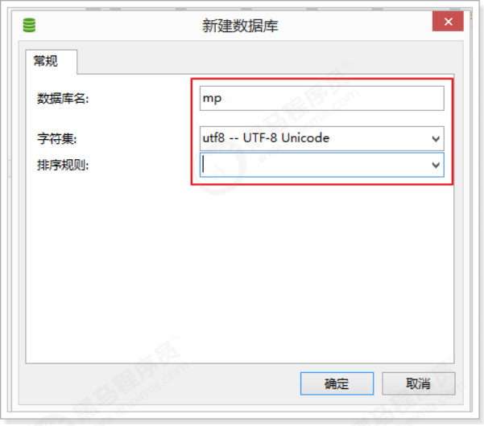
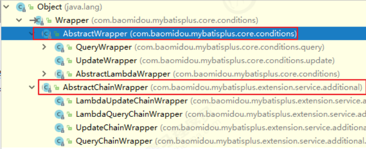
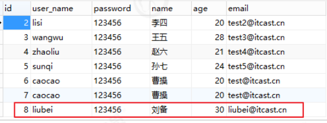

# 1、了解Mybatis-Plus
## 1.1、Mybatis-Plus介绍
MyBatis-Plus（简称 MP）是一个 MyBatis 的增强工具，在 MyBatis 的基础上只做增强不做改变，为简化开发、提高
效率而生。
官网：https://mybatis.plus/ 或 https://mp.baomidou.com/

## 1.2、代码以及文档
文档地址：https://mybatis.plus/guide/
源码地址：https://github.com/baomidou/mybatis-plus

## 1.3、特性
+ 无侵入：只做增强不做改变，引入它不会对现有工程产生影响，如丝般顺滑
+ 损耗小：启动即会自动注入基本 CURD，性能基本无损耗，直接面向对象操作
+ 强大的 CRUD 操作：内置通用 Mapper、通用 Service，仅仅通过少量配置即可实现单表大部分 CRUD 操作，
 更有强大的条件构造器，满足各类使用需求
+ 支持 Lambda 形式调用：通过 Lambda 表达式，方便的编写各类查询条件，无需再担心字段写错
+ 支持多种数据库：支持 MySQL、MariaDB、Oracle、DB2、H2、HSQL、SQLite、Postgre、
SQLServer2005、SQLServer 等多种数据库
+ 支持主键自动生成：支持多达 4 种主键策略（内含分布式唯一 ID 生成器 - Sequence），可自由配置，完美解
决主键问题
+ 支持 XML 热加载：Mapper 对应的 XML 支持热加载，对于简单的 CRUD 操作，甚至可以无 XML 启动
+ 支持 ActiveRecord 模式：支持 ActiveRecord 形式调用，实体类只需继承 Model 类即可进行强大的 CRUD 操
作
+ 支持自定义全局通用操作：支持全局通用方法注入（ Write once, use anywhere ）
+ 支持关键词自动转义：支持数据库关键词（order、key......）自动转义，还可自定义关键词
+ 内置代码生成器：采用代码或者 Maven 插件可快速生成 Mapper 、 Model 、 Service 、 Controller 层代码，
 支持模板引擎，更有超多自定义配置等您来使用
+ 内置分页插件：基于 MyBatis 物理分页，开发者无需关心具体操作，配置好插件之后，写分页等同于普通 List
查询
+ 内置性能分析插件：可输出 Sql 语句以及其执行时间，建议开发测试时启用该功能，能快速揪出慢查询
+ 内置全局拦截插件：提供全表 delete 、 update 操作智能分析阻断，也可自定义拦截规则，预防误操作
+ 内置 Sql 注入剥离器：支持 Sql 注入剥离，有效预防 Sql 注入攻击

## 1.4、架构


## 1.5、作者
Mybatis-Plus是由baomidou（苞米豆）组织开发并且开源的，目前该组织大概有30人左右。
码云地址：https://gitee.com/organizations/baomidou


# 2、快速开始
对于Mybatis整合MP有常常有三种用法，分别是Mybatis+MP、Spring+Mybatis+MP、Spring Boot+Mybatis+MP。

## 2.1、创建数据库以及表

```
-- 创建测试表
CREATE TABLE `tb_user` (
`id` bigint(20) NOT NULL AUTO_INCREMENT COMMENT '主键ID',
`user_name` varchar(20) NOT NULL COMMENT '用户名',
`password` varchar(20) NOT NULL COMMENT '密码',
`name` varchar(30) DEFAULT NULL COMMENT '姓名',
`age` int(11) DEFAULT NULL COMMENT '年龄',
`email` varchar(50) DEFAULT NULL COMMENT '邮箱',
PRIMARY KEY (`id`)
) ENGINE=InnoDB AUTO_INCREMENT=1 DEFAULT CHARSET=utf8;
-- 插入测试数据
INSERT INTO `tb_user` (`id`, `user_name`, `password`, `name`, `age`, `email`) VALUES
('1', 'zhangsan', '123456', '张三', '18', 'test1@itcast.cn');
INSERT INTO `tb_user` (`id`, `user_name`, `password`, `name`, `age`, `email`) VALUES
('2', 'lisi', '123456', '李四', '20', 'test2@itcast.cn');
INSERT INTO `tb_user` (`id`, `user_name`, `password`, `name`, `age`, `email`) VALUES
('3', 'wangwu', '123456', '王五', '28', 'test3@itcast.cn');
INSERT INTO `tb_user` (`id`, `user_name`, `password`, `name`, `age`, `email`) VALUES
('4', 'zhaoliu', '123456', '赵六', '21', 'test4@itcast.cn');
INSERT INTO `tb_user` (`id`, `user_name`, `password`, `name`, `age`, `email`) VALUES
('5', 'sunqi', '123456', '孙七', '24', 'test5@itcast.cn');
```

## 2.2、创建工程
```
导入依赖：
<?xml version="1.0" encoding="UTF-8"?>
<project xmlns="http://maven.apache.org/POM/4.0.0"
xmlns:xsi="http://www.w3.org/2001/XMLSchema-instance"
xsi:schemaLocation="http://maven.apache.org/POM/4.0.0
http://maven.apache.org/xsd/maven-4.0.0.xsd">
<modelVersion>4.0.0</modelVersion>

<groupId>cn.itcast.mp</groupId>
<artifactId>itcast-mybatis-plus</artifactId>
<version>1.0-SNAPSHOT</version>

<modules>
<module>itcast-mybatis-plus-simple</module>
</modules>

<packaging>pom</packaging>

<dependencies>
<!-- mybatis-plus插件依赖 -->
<dependency>
<groupId>com.baomidou</groupId>
<artifactId>mybatis-plus</artifactId>
<version>3.1.1</version>
</dependency>

<!-- MySql -->
<dependency>
<groupId>mysql</groupId>
<artifactId>mysql-connector-java</artifactId>
<version>5.1.47</version>
</dependency>

<!-- 连接池 -->
<dependency>
<groupId>com.alibaba</groupId>
<artifactId>druid</artifactId>
<version>1.0.11</version>
</dependency>

<!--简化bean代码的工具包-->
<dependency>
<groupId>org.projectlombok</groupId>
<artifactId>lombok</artifactId>
<optional>true</optional>
<version>1.18.4</version>
</dependency>

<dependency>
<groupId>junit</groupId>
<artifactId>junit</artifactId>
<version>4.12</version>
</dependency>

<dependency>
<groupId>org.slf4j</groupId>
<artifactId>slf4j-log4j12</artifactId>
<version>1.6.4</version>
</dependency>

</dependencies>

<build>
<plugins>
<plugin>
<groupId>org.apache.maven.plugins</groupId>
<artifactId>maven-compiler-plugin</artifactId>
<configuration>
<source>1.8</source>
<target>1.8</target>
</configuration>
</plugin>
</plugins>
</build>

</project>
```

## 2.3、Mybatis + MP
下面演示，通过纯Mybatis与Mybatis-Plus整合。

### 2.3.1、创建子Module
```
<?xml version="1.0" encoding="UTF-8"?>
<project xmlns="http://maven.apache.org/POM/4.0.0"
xmlns:xsi="http://www.w3.org/2001/XMLSchema-instance"
xsi:schemaLocation="http://maven.apache.org/POM/4.0.0
http://maven.apache.org/xsd/maven-4.0.0.xsd">

<parent>
<artifactId>itcast-mybatis-plus</artifactId>
<groupId>cn.itcast.mp</groupId>
<version>1.0-SNAPSHOT</version>
</parent>

<modelVersion>4.0.0</modelVersion>
<packaging>jar</packaging>

<artifactId>itcast-mybatis-plus-simple</artifactId>

</project>
```
log4j.properties：
```
log4j.rootLogger=DEBUG,A1
log4j.appender.A1=org.apache.log4j.ConsoleAppender
log4j.appender.A1.layout=org.apache.log4j.PatternLayout
log4j.appender.A1.layout.ConversionPattern=[%t] [%c]-[%p] %m%n
```

### 2.3.2、Mybatis实现查询User
第一步，编写mybatis-config.xml文件：
```
<?xml version="1.0" encoding="UTF-8" ?>
<!DOCTYPE configuration
PUBLIC "-//mybatis.org//DTD Config 3.0//EN"
"http://mybatis.org/dtd/mybatis-3-config.dtd">

<configuration>

<environments default="development">
<environment id="development">
<transactionManager type="JDBC"/>
<dataSource type="POOLED">
<property name="driver" value="com.mysql.jdbc.Driver"/>
<property name="url" value="jdbc:mysql://127.0.0.1:3306/mp?
useUnicode=true&amp;characterEncoding=utf8&amp;autoReconnect=true&amp;allowMultiQuerie
s=true&amp;useSSL=false"/>

<property name="username" value="root"/>
<property name="password" value="root"/>
</dataSource>
</environment>

</environments>

<mappers>
<mapper resource="UserMapper.xml"/>
</mappers>

</configuration>
```
第二步，编写User实体对象：（这里使用lombok进行了进化bean操作）
```
package cn.itcast.mp.simple.pojo;

import lombok.AllArgsConstructor;
import lombok.Data;
import lombok.NoArgsConstructor;

@Data
@NoArgsConstructor
@AllArgsConstructor
public class User {

private Long id;
private String userName;
private String password;
private String name;
private Integer age;
private String email;

}
```
第三步，编写UserMapper接口：
```
package cn.itcast.mp.simple.mapper;

import cn.itcast.mp.simple.pojo.User;
import java.util.List;

public interface UserMapper {
List<User> findAll();
}
```
第四步，编写UserMapper.xml文件：
```
<?xml version="1.0" encoding="UTF-8" ?>
<!DOCTYPE mapper
PUBLIC "-//mybatis.org//DTD Mapper 3.0//EN"
"http://mybatis.org/dtd/mybatis-3-mapper.dtd">

<mapper namespace="cn.itcast.mp.simple.mapper.UserMapper">

<select id="findAll" resultType="cn.itcast.mp.simple.pojo.User">
select * from tb_user
</select>

</mapper>
```
第五步，编写TestMybatis测试用例：
```
package cn.itcast.mp.simple;

import cn.itcast.mp.simple.mapper.UserMapper;
import cn.itcast.mp.simple.pojo.User;

import org.apache.ibatis.io.Resources;
import org.apache.ibatis.session.SqlSession;
import org.apache.ibatis.session.SqlSessionFactory;
import org.apache.ibatis.session.SqlSessionFactoryBuilder;
import org.junit.Test;
import java.io.InputStream;
import java.util.List;

public class TestMybatis{
@Test
public void testUserList() throws Exception{
String resource = "mybatis-config.xml";
InputStream inputStream = Resources.getResourceAsStream(resource);
SqlSessionFactory sqlSessionFactory = new
SqlSessionFactoryBuilder().build(inputStream);
SqlSession sqlSession = sqlSessionFactory.openSession();

UserMapper userMapper = sqlSession.getMapper(UserMapper.class);

List<User> list = userMapper.findAll();
for (User user : list) {
    System.out.println(user);
        }
    }
}
```
测试结果：
```
[main] [cn.itcast.mp.simple.mapper.UserMapper.findAll]-[DEBUG] ==> Parameters:
[main] [cn.itcast.mp.simple.mapper.UserMapper.findAll]-[DEBUG] <== Total: 5
User(id=1, userName=null, password=123456, name=张三, age=18, email=test1@itcast.cn)
User(id=2, userName=null, password=123456, name=李四, age=20, email=test2@itcast.cn)
User(id=3, userName=null, password=123456, name=王五, age=28, email=test3@itcast.cn)
User(id=4, userName=null, password=123456, name=赵六, age=21, email=test4@itcast.cn)
User(id=5, userName=null, password=123456, name=孙七, age=24, email=test5@itcast.cn)
```
### 2.3.3、Mybatis+MP实现查询User
第一步，将UserMapper继承BaseMapper，将拥有了BaseMapper中的所有方法：
```
package cn.itcast.mp.simple.mapper;

import cn.itcast.mp.simple.pojo.User;
import com.baomidou.mybatisplus.core.mapper.BaseMapper;
import java.util.List;

public interface UserMapper extends BaseMapper<User> {
List<User> findAll();
}
```
第二步，使用MP中的MybatisSqlSessionFactoryBuilder进程构建：
```
package cn.itcast.mp.simple;

import cn.itcast.mp.simple.mapper.UserMapper;
import cn.itcast.mp.simple.pojo.User;

import com.baomidou.mybatisplus.core.MybatisSqlSessionFactoryBuilder;
import org.apache.ibatis.io.Resources;
import org.apache.ibatis.session.SqlSession;
import org.apache.ibatis.session.SqlSessionFactory;
import org.apache.ibatis.session.SqlSessionFactoryBuilder;
import org.junit.Test;
import java.io.InputStream;
import java.util.List;

public class TestMybatisPlus {
@Test
public void testUserList() throws Exception{
String resource = "mybatis-config.xml";
InputStream inputStream = Resources.getResourceAsStream(resource);
//这里使用的是MP中的MybatisSqlSessionFactoryBuilder
SqlSessionFactory sqlSessionFactory = new
MybatisSqlSessionFactoryBuilder().build(inputStream);
SqlSession sqlSession = sqlSessionFactory.openSession();

UserMapper userMapper = sqlSession.getMapper(UserMapper.class);

// 可以调用BaseMapper中定义的方法
List<User> list = userMapper.selectList(null);
for (User user : list) {
System.out.println(user);
        }
    }
}
```
运行报错：

解决：在User对象中添加@TableName，指定数据库表名


测试：
```
[main] [cn.itcast.mp.simple.mapper.UserMapper.selectList]-[DEBUG] ==> Preparing:
SELECT id,user_name,password,name,age,email FROM tb_user
[main] [cn.itcast.mp.simple.mapper.UserMapper.selectList]-[DEBUG] ==> Parameters:
[main] [cn.itcast.mp.simple.mapper.UserMapper.selectList]-[DEBUG] <== Total: 5
User(id=1, userName=zhangsan, password=123456, name=张三, age=18, email=test1@itcast.cn)
User(id=2, userName=lisi, password=123456, name=李四, age=20, email=test2@itcast.cn)
User(id=3, userName=wangwu, password=123456, name=王五, age=28, email=test3@itcast.cn)
User(id=4, userName=zhaoliu, password=123456, name=赵六, age=21, email=test4@itcast.cn)
User(id=5, userName=sunqi, password=123456, name=孙七, age=24, email=test5@itcast.cn)
```
简单说明：
+ 由于使用了MybatisSqlSessionFactoryBuilder进行了构建，继承的BaseMapper中的方法就载入到了
SqlSession中，所以就可以直接使用相关的方法；

+ 如图：


## 2.4、Spring + Mybatis + MP
引入了Spring框架，数据源、构建等工作就交给了Spring管理。
### 2.4.1、创建子Module
```
<?xml version="1.0" encoding="UTF-8"?>
<project xmlns="http://maven.apache.org/POM/4.0.0"
xmlns:xsi="http://www.w3.org/2001/XMLSchema-instance"
xsi:schemaLocation="http://maven.apache.org/POM/4.0.0
http://maven.apache.org/xsd/maven-4.0.0.xsd">

<parent>
<artifactId>itcast-mybatis-plus</artifactId>
<groupId>cn.itcast.mp</groupId>
<version>1.0-SNAPSHOT</version>
</parent>
<modelVersion>4.0.0</modelVersion>

<artifactId>itcast-mybatis-plus-spring</artifactId>

<properties>
<spring.version>5.1.6.RELEASE</spring.version>
</properties>

<dependencies>
<dependency>
<groupId>org.springframework</groupId>
<artifactId>spring-webmvc</artifactId>
<version>${spring.version}</version>
</dependency>

<dependency>
<groupId>org.springframework</groupId>
<artifactId>spring-jdbc</artifactId>
<version>${spring.version}</version>
</dependency>

<dependency>
<groupId>org.springframework</groupId>
<artifactId>spring-test</artifactId>
<version>${spring.version}</version>
</dependency>

</dependencies>

</project>
```
### 2.4.2、实现查询User
第一步，编写jdbc.properties
```
jdbc.driver=com.mysql.jdbc.Driver
jdbc.url=jdbc:mysql://127.0.0.1:3306/mp?
useUnicode=true&characterEncoding=utf8&autoReconnect=true&allowMultiQueries=true&useSSL
=false
jdbc.username=root
jdbc.password=root
```
第二步，编写applicationContext.xml
```
<?xml version="1.0" encoding="UTF-8"?>
<beans xmlns="http://www.springframework.org/schema/beans"
xmlns:xsi="http://www.w3.org/2001/XMLSchema-instance"
xmlns:context="http://www.springframework.org/schema/context"
xsi:schemaLocation="http://www.springframework.org/schema/beans
http://www.springframework.org/schema/beans/spring-beans.xsd
http://www.springframework.org/schema/context
http://www.springframework.org/schema/context/spring-context.xsd">

<context:property-placeholder location="classpath:*.properties"/>

<!-- 定义数据源 -->
<bean id="dataSource" class="com.alibaba.druid.pool.DruidDataSource"
destroy-method="close">

<property name="url" value="${jdbc.url}"/>
<property name="username" value="${jdbc.username}"/>
<property name="password" value="${jdbc.password}"/>
<property name="driverClassName" value="${jdbc.driver}"/>
<property name="maxActive" value="10"/>
<property name="minIdle" value="5"/>
</bean>

<!--这里使用MP提供的sqlSessionFactory，完成了Spring与MP的整合-->
<bean id="sqlSessionFactory"
class="com.baomidou.mybatisplus.extension.spring.MybatisSqlSessionFactoryBean">
<property name="dataSource" ref="dataSource"/>
</bean>

<!--扫描mapper接口，使用的依然是Mybatis原生的扫描器-->
<bean class="org.mybatis.spring.mapper.MapperScannerConfigurer">
<property name="basePackage" value="cn.itcast.mp.simple.mapper"/>
</bean>

</beans>
```
第三步，编写User对象以及UserMapper接口：
```
package cn.itcast.mp.simple.pojo;

import com.baomidou.mybatisplus.annotation.TableName;
import lombok.AllArgsConstructor;
import lombok.Data;
import lombok.NoArgsConstructor;

@Data
@NoArgsConstructor
@AllArgsConstructor
@TableName("tb_user")
public class User {

private Long id;
private String userName;
private String password;
private String name;
private Integer age;
private String email;

}


package cn.itcast.mp.simple.mapper;

import cn.itcast.mp.simple.pojo.User;
import com.baomidou.mybatisplus.core.mapper.BaseMapper;

public interface UserMapper extends BaseMapper<User> {

}
```
第四步，编写测试用例：
```
package cn.itcast.mp.simple;

import cn.itcast.mp.simple.mapper.UserMapper;
import cn.itcast.mp.simple.pojo.User;
import org.junit.Test;
import org.junit.runner.RunWith;
import org.springframework.beans.factory.annotation.Autowired;
import org.springframework.test.context.ContextConfiguration;
import org.springframework.test.context.junit4.SpringJUnit4ClassRunner;
import java.util.List;

@RunWith(SpringJUnit4ClassRunner.class)
@ContextConfiguration(locations = "classpath:applicationContext.xml")
public class TestSpringMP {

@Autowired
private UserMapper userMapper;

@Test
public void testSelectList(){
List<User> users = this.userMapper.selectList(null);
for (User user : users) {
System.out.println(user);
        }
    }
}
```

测试：
```
[main] [cn.itcast.mp.simple.mapper.UserMapper.selectList]-[DEBUG] ==> Preparing:
SELECT id,user_name,password,name,age,email FROM tb_user
[main] [cn.itcast.mp.simple.mapper.UserMapper.selectList]-[DEBUG] ==> Parameters:
[main] [cn.itcast.mp.simple.mapper.UserMapper.selectList]-[DEBUG] <== Total: 5
[main] [org.mybatis.spring.SqlSessionUtils]-[DEBUG] Closing non transactional
SqlSession [org.apache.ibatis.session.defaults.DefaultSqlSession@74287ea3]
User(id=1, userName=zhangsan, password=123456, name=张三, age=18,
email=test1@itcast.cn)
User(id=2, userName=lisi, password=123456, name=李四, age=20, email=test2@itcast.cn)
User(id=3, userName=wangwu, password=123456, name=王五, age=28, email=test3@itcast.cn)
User(id=4, userName=zhaoliu, password=123456, name=赵六, age=21, email=test4@itcast.cn)
User(id=5, userName=sunqi, password=123456, name=孙七, age=24, email=test5@itcast.cn)

```

## 2.5、SpringBoot + Mybatis + MP
使用SpringBoot将进一步的简化MP的整合，需要注意的是，由于使用SpringBoot需要继承parent，所以需要重新创
建工程，并不是创建子Module。
### 2.5.1、创建工程
### 2.5.2、导入依赖
```
<?xml version="1.0" encoding="UTF-8"?>
<project xmlns="http://maven.apache.org/POM/4.0.0"
xmlns:xsi="http://www.w3.org/2001/XMLSchema-instance"
xsi:schemaLocation="http://maven.apache.org/POM/4.0.0
http://maven.apache.org/xsd/maven-4.0.0.xsd">
<modelVersion>4.0.0</modelVersion>

<parent>
<groupId>org.springframework.boot</groupId>
<artifactId>spring-boot-starter-parent</artifactId>
<version>2.1.4.RELEASE</version>
</parent>

<groupId>cn.itcast.mp</groupId>
<artifactId>itcast-mp-springboot</artifactId>
<version>1.0-SNAPSHOT</version>

<dependencies>

<dependency>
<groupId>org.springframework.boot</groupId>
<artifactId>spring-boot-starter</artifactId>
<exclusions>
<exclusion>
<groupId>org.springframework.boot</groupId>
<artifactId>spring-boot-starter-logging</artifactId>
</exclusion>
</exclusions>
</dependency>

<dependency>
<groupId>org.springframework.boot</groupId>
<artifactId>spring-boot-starter-test</artifactId>
<scope>test</scope>
</dependency>

<!--简化代码的工具包-->
<dependency>
<groupId>org.projectlombok</groupId>
<artifactId>lombok</artifactId>
<optional>true</optional>
</dependency>

<!--mybatis-plus的springboot支持-->
<dependency>
<groupId>com.baomidou</groupId>
<artifactId>mybatis-plus-boot-starter</artifactId>
<version>3.1.1</version>
</dependency>

<!--mysql驱动-->
<dependency>
<groupId>mysql</groupId>
<artifactId>mysql-connector-java</artifactId>
<version>5.1.47</version>
</dependency>

<dependency>
<groupId>org.slf4j</groupId>
<artifactId>slf4j-log4j12</artifactId>
</dependency>

</dependencies>


<build>
<plugins>
<plugin>
<groupId>org.springframework.boot</groupId>
<artifactId>spring-boot-maven-plugin</artifactId>
</plugin>
</plugins>
</build>
</project>
```
log4j.properties：
```
log4j.rootLogger=DEBUG,A1
log4j.appender.A1=org.apache.log4j.ConsoleAppender
log4j.appender.A1.layout=org.apache.log4j.PatternLayout
log4j.appender.A1.layout.ConversionPattern=[%t] [%c]-[%p] %m%n
```
### 2.5.3、编写application.properties
```
spring.application.name = itcast-mp-springboot
spring.datasource.driver-class-name=com.mysql.jdbc.Driver
spring.datasource.url=jdbc:mysql://127.0.0.1:3306/mp?
useUnicode=true&characterEncoding=utf8&autoReconnect=true&allowMultiQueries=true&useSSL
=false
spring.datasource.username=root
spring.datasource.password=root
```
### 2.5.4、编写pojo
```
package cn.itcast.mp.pojo;

import com.baomidou.mybatisplus.annotation.TableName;
import lombok.AllArgsConstructor;
import lombok.Data;
import lombok.NoArgsConstructor;

@Data
@NoArgsConstructor
@AllArgsConstructor
@TableName("tb_user")
public class User {

private Long id;
private String userName;
private String password;
private String name;
private Integer age;
private String email;
}
```
### 2.5.5、编写mapper
```
package cn.itcast.mp.mapper;

import cn.itcast.mp.pojo.User;
import com.baomidou.mybatisplus.core.mapper.BaseMapper;

public interface UserMapper extends BaseMapper<User> {
}
```
### 2.5.6、编写启动类
```
package cn.itcast.mp;

import org.mybatis.spring.annotation.MapperScan;
import org.springframework.boot.SpringApplication;
import org.springframework.boot.WebApplicationType;
import org.springframework.boot.autoconfigure.SpringBootApplication;
import org.springframework.boot.builder.SpringApplicationBuilder;

@MapperScan("cn.itcast.mp.mapper") //设置mapper接口的扫描包
@SpringBootApplication
public class MyApplication {

public static void main(String[] args) {
SpringApplication.run(MyApplication.class, args);
}
}
```
### 2.5.7、编写测试用例
```
package cn.itcast.mp;

import cn.itcast.mp.mapper.UserMapper;
import cn.itcast.mp.pojo.User;
import org.junit.Test;
import org.junit.runner.RunWith;
import org.springframework.beans.factory.annotation.Autowired;
import org.springframework.boot.test.context.SpringBootTest;
import org.springframework.test.context.junit4.SpringRunner;
import java.util.List;

@RunWith(SpringRunner.class)
@SpringBootTest
public class UserMapperTest {

@Autowired
private UserMapper userMapper;

@Test
public void testSelect() {
List<User> userList = userMapper.selectList(null);
for (User user : userList) {
System.out.println(user);
        }
    }
}
```
测试：
```
[main] [cn.itcast.mp.mapper.UserMapper.selectList]-[DEBUG] ==> Preparing: SELECT
id,user_name,password,name,age,email FROM tb_user
[main] [cn.itcast.mp.mapper.UserMapper.selectList]-[DEBUG] ==> Parameters:
[main] [cn.itcast.mp.mapper.UserMapper.selectList]-[DEBUG] <== Total: 5
[main] [org.mybatis.spring.SqlSessionUtils]-[DEBUG] Closing non transactional
SqlSession [org.apache.ibatis.session.defaults.DefaultSqlSession@14faa38c]
User(id=1, userName=zhangsan, password=123456, name=张三, age=18, email=test1@itcast.cn)
User(id=2, userName=lisi, password=123456, name=李四, age=20, email=test2@itcast.cn)
User(id=3, userName=wangwu, password=123456, name=王五, age=28, email=test3@itcast.cn)
User(id=4, userName=zhaoliu, password=123456, name=赵六, age=21, email=test4@itcast.cn)
User(id=5, userName=sunqi, password=123456, name=孙七, age=24, email=test5@itcast.cn)
```

# 3、通用CRUD
通过前面，我们了解到通过继承BaseMapper就可以获取到各种各样的单表操作，接下来我们将详细讲解这些
操作。


## 3.1、插入操作
### 3.1.1、方法定义
```
/**
* 插入一条记录
*
* @param entity 实体对象
*/
int insert(T entity);
```

### 3.1.2、测试用例
```
package cn.itcast.mp;

import cn.itcast.mp.mapper.UserMapper;
import cn.itcast.mp.pojo.User;
import org.junit.Test;
import org.junit.runner.RunWith;
import org.springframework.beans.factory.annotation.Autowired;
import org.springframework.boot.test.context.SpringBootTest;
import org.springframework.test.context.junit4.SpringRunner;
import java.util.List;

@RunWith(SpringRunner.class)
@SpringBootTest
public class UserMapperTest {

@Autowired
private UserMapper userMapper;

@Test
public void testInsert(){

User user = new User();
user.setAge(20);
user.setEmail("test@itcast.cn");
user.setName("曹操");
user.setUserName("caocao");
user.setPassword("123456");

int result = this.userMapper.insert(user); //返回的result是受影响的行数，并不是自增
后的id

System.out.println("result = " + result);
System.out.println(user.getId()); //自增后的id会回填到对象中
    }
}
```

### 3.1.3、测试
```
[main] [cn.itcast.mp.mapper.UserMapper.insert]-[DEBUG] ==> Preparing: INSERT INTO
tb_user ( id, user_name, password, name, age, email ) VALUES ( ?, ?, ?, ?, ?, ? )
[main] [cn.itcast.mp.mapper.UserMapper.insert]-[DEBUG] ==> Parameters:
1122045867793072130(Long), caocao(String), 123456(String), 曹操(String), 20(Integer),
test@itcast.cn(String)
[main] [cn.itcast.mp.mapper.UserMapper.insert]-[DEBUG] <== Updates: 1
[main] [org.mybatis.spring.SqlSessionUtils]-[DEBUG] Closing non transactional
SqlSession [org.apache.ibatis.session.defaults.DefaultSqlSession@411291e5]
result = 1
1122045867793072130
```

可以看到，数据已经写入到了数据库，但是，id的值不正确，我们期望的是数据库自增长，实际是MP生成了id的值
写入到了数据库。

如何设置id的生成策略呢？
MP支持的id策略：
```
package com.baomidou.mybatisplus.annotation;

import lombok.Getter;

/**
* 生成ID类型枚举类
*
* @author hubin
* @since 2015-11-10
*/
@Getter
public enum IdType {

/**
* 数据库ID自增
*/
AUTO(0),

/**
* 该类型为未设置主键类型
*/
NONE(1),

/**
* 用户输入ID
* <p>该类型可以通过自己注册自动填充插件进行填充</p>
*/
INPUT(2),

/* 以下3种类型、只有当插入对象ID 为空，才自动填充。 */
/**
* 全局唯一ID (idWorker)
*/
ID_WORKER(3),

/**
* 全局唯一ID (UUID)
*/
UUID(4),

/**
* 字符串全局唯一ID (idWorker 的字符串表示)
*/
ID_WORKER_STR(5);
private final int key;
IdType(int key) {
this.key = key;
    }
}
```
修改User对象：
```
package cn.itcast.mp.pojo;

import com.baomidou.mybatisplus.annotation.IdType;
import com.baomidou.mybatisplus.annotation.TableId;
import com.baomidou.mybatisplus.annotation.TableName;
import lombok.AllArgsConstructor;
import lombok.Data;
import lombok.NoArgsConstructor;

@Data
@NoArgsConstructor
@AllArgsConstructor
@TableName("tb_user")
public class User {

@TableId(type = IdType.AUTO) //指定id类型为自增长
private Long id;

private String userName;
private String password;
private String name;
private Integer age;
private String email;
}
```

### 3.1.4、@TableField
在MP中通过@TableField注解可以指定字段的一些属性，常常解决的问题有2个：
1、对象中的属性名和字段名不一致的问题（非驼峰）
2、对象中的属性字段在表中不存在的问题
使用


其他用法，如大字段不加入查询字段：


效果：


## 3.2、更新操作
在MP中，更新操作有2种，一种是根据id更新，另一种是根据条件更新。
### 3.2.1、根据id更新
方法定义：
```
/**
* 根据 ID 修改
*
* @param entity 实体对象
*/
int updateById(@Param(Constants.ENTITY) T entity);
```
测试：
```
@RunWith(SpringRunner.class)
@SpringBootTest
public class UserMapperTest {

@Autowired
private UserMapper userMapper;

@Test
public void testUpdateById() {

User user = new User();
user.setId(6L); //主键
user.setAge(21); //更新的字段
//根据id更新，更新不为null的字段
this.userMapper.updateById(user);
    }
}
```
结果：
```
[main] [cn.itcast.mp.mapper.UserMapper.updateById]-[DEBUG] ==> Preparing: UPDATE
tb_user SET age=? WHERE id=?
[main] [cn.itcast.mp.mapper.UserMapper.updateById]-[DEBUG] ==> Parameters: 21(Integer),
6(Long)
[main] [cn.itcast.mp.mapper.UserMapper.updateById]-[DEBUG] <== Updates: 1
```

### 3.2.2、根据条件更新
方法定义：
```
/**
* 根据 whereEntity 条件，更新记录
*
* @param entity 实体对象 (set 条件值,可以为 null)
* @param updateWrapper 实体对象封装操作类（可以为 null,里面的 entity 用于生成 where 语句）
*/
int update(@Param(Constants.ENTITY) T entity, @Param(Constants.WRAPPER) Wrapper<T>
updateWrapper);
```
测试用例：
```
package cn.itcast.mp;

import cn.itcast.mp.mapper.UserMapper;
import cn.itcast.mp.pojo.User;
import com.baomidou.mybatisplus.core.conditions.Wrapper;
import com.baomidou.mybatisplus.core.conditions.query.QueryWrapper;
import com.baomidou.mybatisplus.core.conditions.update.UpdateWrapper;
import net.minidev.json.writer.UpdaterMapper;
import org.junit.Test;
import org.junit.runner.RunWith;
import org.springframework.beans.factory.annotation.Autowired;
import org.springframework.boot.test.context.SpringBootTest;
import org.springframework.test.context.junit4.SpringRunner;
import java.util.List;

@RunWith(SpringRunner.class)
@SpringBootTest
public class UserMapperTest {

@Autowired
private UserMapper userMapper;

@Test
public void testUpdate() {

User user = new User();
user.setAge(22); //更新的字段

//更新的条件
QueryWrapper<User> wrapper = new QueryWrapper<>();
wrapper.eq("id", 6);

//执行更新操作
int result = this.userMapper.update(user, wrapper);
System.out.println("result = " + result);
    }
}
```
或者，通过UpdateWrapper进行更新：
```
@Test
public void testUpdate() {
//更新的条件以及字段
UpdateWrapper<User> wrapper = new UpdateWrapper<>();

wrapper.eq("id", 6).set("age", 23);

//执行更新操作
int result = this.userMapper.update(null, wrapper);

System.out.println("result = " + result);
}
```
测试结果：
```
[main] [cn.itcast.mp.mapper.UserMapper.update]-[DEBUG] ==> Preparing: UPDATE tb_user
SET age=? WHERE id = ?
[main] [cn.itcast.mp.mapper.UserMapper.update]-[DEBUG] ==> Parameters: 23(Integer),
6(Integer)
[main] [cn.itcast.mp.mapper.UserMapper.update]-[DEBUG] <== Updates: 1
```
均可达到更新的效果。
关于wrapper更多的用法后面会详细讲解。

## 3.3、删除操作
### 3.3.1、deleteById
方法定义：
```
/**
* 根据 ID 删除
*
* @param id 主键ID
*/
int deleteById(Serializable id);
```
测试用例：
```
package cn.itcast.mp;
import cn.itcast.mp.mapper.UserMapper;
import org.junit.Test;
import org.junit.runner.RunWith;
import org.springframework.beans.factory.annotation.Autowired;
import org.springframework.boot.test.context.SpringBootTest;
import org.springframework.test.context.junit4.SpringRunner;

@RunWith(SpringRunner.class)
@SpringBootTest
public class UserMapperTest {

@Autowired
private UserMapper userMapper;

@Test
public void testDeleteById() {
//执行删除操作
int result = this.userMapper.deleteById(6L);
System.out.println("result = " + result);
    }
}
```
结果：
```
[main] [cn.itcast.mp.mapper.UserMapper.deleteById]-[DEBUG] ==> Preparing: DELETE FROM
tb_user WHERE id=?
[main] [cn.itcast.mp.mapper.UserMapper.deleteById]-[DEBUG] ==> Parameters: 6(Long)
[main] [cn.itcast.mp.mapper.UserMapper.deleteById]-[DEBUG] <== Updates: 1
```


3.3.2、deleteByMap
方法定义：
```
/**
* 根据 columnMap 条件，删除记录
*
* @param columnMap 表字段 map 对象
*/
int deleteByMap(@Param(Constants.COLUMN_MAP) Map<String, Object> columnMap);
```
测试用例：
```
package cn.itcast.mp;
import cn.itcast.mp.mapper.UserMapper;
import org.junit.Test;
import org.junit.runner.RunWith;
import org.springframework.beans.factory.annotation.Autowired;
import org.springframework.boot.test.context.SpringBootTest;
import org.springframework.test.context.junit4.SpringRunner;
import java.util.HashMap;
import java.util.Map;

@RunWith(SpringRunner.class)
@SpringBootTest
public class UserMapperTest {

@Autowired
private UserMapper userMapper;

@Test
public void testDeleteByMap() {

Map<String, Object> columnMap = new HashMap<>();
columnMap.put("age",20);
columnMap.put("name","张三");

//将columnMap中的元素设置为删除的条件，多个之间为and关系
int result = this.userMapper.deleteByMap(columnMap);

System.out.println("result = " + result);
    }
}
```
结果：
```
[main] [cn.itcast.mp.mapper.UserMapper.deleteByMap]-[DEBUG] ==> Preparing: DELETE FROM
tb_user WHERE name = ? AND age = ?
[main] [cn.itcast.mp.mapper.UserMapper.deleteByMap]-[DEBUG] ==> Parameters: 张三
(String), 20(Integer)
[main] [cn.itcast.mp.mapper.UserMapper.deleteByMap]-[DEBUG] <== Updates: 0
```
### 3.3.3、delete
方法定义：
```
/**
* 根据 entity 条件，删除记录
*
* @param wrapper 实体对象封装操作类（可以为 null）
*/
int delete(@Param(Constants.WRAPPER) Wrapper<T> wrapper);
```

测试用例：
```
package cn.itcast.mp;

import cn.itcast.mp.mapper.UserMapper;
import cn.itcast.mp.pojo.User;
import com.baomidou.mybatisplus.core.conditions.query.QueryWrapper;
import org.junit.Test;
import org.junit.runner.RunWith;
import org.springframework.beans.factory.annotation.Autowired;
import org.springframework.boot.test.context.SpringBootTest;
import org.springframework.test.context.junit4.SpringRunner;
import java.util.HashMap;
import java.util.Map;

@RunWith(SpringRunner.class)
@SpringBootTest
public class UserMapperTest {

@Autowired
private UserMapper userMapper;

@Test
public void testDeleteByMap() {

User user = new User();
user.setAge(20);
user.setName("张三");

//将实体对象进行包装，包装为操作条件
QueryWrapper<User> wrapper = new QueryWrapper<>(user);

int result = this.userMapper.delete(wrapper);

System.out.println("result = " + result);
    }
}
```

结果：
```
[main] [cn.itcast.mp.mapper.UserMapper.delete]-[DEBUG] ==> Preparing: DELETE FROM
tb_user WHERE name=? AND age=?
[main] [cn.itcast.mp.mapper.UserMapper.delete]-[DEBUG] ==> Parameters: 张三(String),
20(Integer)
[main] [cn.itcast.mp.mapper.UserMapper.delete]-[DEBUG] <== Updates: 0
```

### 3.3.4、deleteBatchIds
方法定义：
```
/**
* 删除（根据ID 批量删除）
*
* @param idList 主键ID列表(不能为 null 以及 empty)
*/
int deleteBatchIds(@Param(Constants.COLLECTION) Collection<? extends Serializable>
idList);
```

测试用例：
```
package cn.itcast.mp;

import cn.itcast.mp.mapper.UserMapper;
import org.junit.Test;
import org.junit.runner.RunWith;
import org.springframework.beans.factory.annotation.Autowired;
import org.springframework.boot.test.context.SpringBootTest;
import org.springframework.test.context.junit4.SpringRunner;
import java.util.Arrays;

@RunWith(SpringRunner.class)
@SpringBootTest
public class UserMapperTest {

@Autowired
private UserMapper userMapper;

@Test
public void testDeleteByMap() {
//根据id集合批量删除
int result = this.userMapper.deleteBatchIds(Arrays.asList(1L,10L,20L));

System.out.println("result = " + result);
    }
}
```

结果：
```
[main] [cn.itcast.mp.mapper.UserMapper.deleteBatchIds]-[DEBUG] ==> Preparing: DELETE
FROM tb_user WHERE id IN ( ? , ? , ? )
[main] [cn.itcast.mp.mapper.UserMapper.deleteBatchIds]-[DEBUG] ==> Parameters: 1(Long),
10(Long), 20(Long)
[main] [cn.itcast.mp.mapper.UserMapper.deleteBatchIds]-[DEBUG] <== Updates: 1
```

## 3.4、查询操作
MP提供了多种查询操作，包括根据id查询、批量查询、查询单条数据、查询列表、分页查询等操作。
### 3.4.1、selectById
方法定义：
```
/**
* 根据 ID 查询
*
* @param id 主键ID
*/
T selectById(Serializable id);
```

测试用例：
```
package cn.itcast.mp;

import cn.itcast.mp.mapper.UserMapper;
import cn.itcast.mp.pojo.User;
import org.junit.Test;
import org.junit.runner.RunWith;
import org.springframework.beans.factory.annotation.Autowired;
import org.springframework.boot.test.context.SpringBootTest;
import org.springframework.test.context.junit4.SpringRunner;

@RunWith(SpringRunner.class)
@SpringBootTest
public class UserMapperTest {

@Autowired
private UserMapper userMapper;

@Test
public void testSelectById() {
//根据id查询数据
User user = this.userMapper.selectById(2L);

System.out.println("result = " + user);
    }
}
```

结果：
```
[main] [cn.itcast.mp.mapper.UserMapper.selectById]-[DEBUG] ==> Preparing: SELECT
id,user_name,password,name,age,email FROM tb_user WHERE id=?
[main] [cn.itcast.mp.mapper.UserMapper.selectById]-[DEBUG] ==> Parameters: 2(Long)
[main] [cn.itcast.mp.mapper.UserMapper.selectById]-[DEBUG] <== Total: 1
result = User(id=2, userName=lisi, password=123456, name=李四, age=20,
email=test2@itcast.cn, address=null)
```


### 3.4.2、selectBatchIds
方法定义：
```
/**
* 查询（根据ID 批量查询）
*
* @param idList 主键ID列表(不能为 null 以及 empty)
*/
List<T> selectBatchIds(@Param(Constants.COLLECTION) Collection<? extends Serializable>
idList);
```

测试用例：
```
package cn.itcast.mp;

import cn.itcast.mp.mapper.UserMapper;
import cn.itcast.mp.pojo.User;
import org.junit.Test;
import org.junit.runner.RunWith;
import org.springframework.beans.factory.annotation.Autowired;
import org.springframework.boot.test.context.SpringBootTest;
import org.springframework.test.context.junit4.SpringRunner;
import java.util.Arrays;
import java.util.List;

@RunWith(SpringRunner.class)
@SpringBootTest
public class UserMapperTest {

@Autowired
private UserMapper userMapper;

@Test
public void testSelectBatchIds() {

//根据id集合批量查询
List<User> users = this.userMapper.selectBatchIds(Arrays.asList(2L, 3L, 10L));

for (User user : users) {
System.out.println(user);
        }
    }
}
```

结果：
```
[main] [cn.itcast.mp.mapper.UserMapper.selectBatchIds]-[DEBUG] ==> Preparing: SELECT
id,user_name,password,name,age,email FROM tb_user WHERE id IN ( ? , ? , ? )
[main] [cn.itcast.mp.mapper.UserMapper.selectBatchIds]-[DEBUG] ==> Parameters: 2(Long),
3(Long), 10(Long)
[main] [cn.itcast.mp.mapper.UserMapper.selectBatchIds]-[DEBUG] <== Total: 2
User(id=2, userName=lisi, password=123456, name=李四, age=20, email=test2@itcast.cn,
address=null)
User(id=3, userName=wangwu, password=123456, name=王五, age=28, email=test3@itcast.cn,
address=null)
```


### 3.4.3、selectOne
方法定义：
```
/**
* 根据 entity 条件，查询一条记录
*
* @param queryWrapper 实体对象封装操作类（可以为 null）
*/
T selectOne(@Param(Constants.WRAPPER) Wrapper<T> queryWrapper);
```

测试用例：
```
package cn.itcast.mp;

import cn.itcast.mp.mapper.UserMapper;
import cn.itcast.mp.pojo.User;
import com.baomidou.mybatisplus.core.conditions.query.QueryWrapper;
import org.junit.Test;
import org.junit.runner.RunWith;
import org.springframework.beans.factory.annotation.Autowired;
import org.springframework.boot.test.context.SpringBootTest;
import org.springframework.test.context.junit4.SpringRunner;

@RunWith(SpringRunner.class)
@SpringBootTest
public class UserMapperTest {

@Autowired
private UserMapper userMapper;

@Test
public void testSelectOne() {

QueryWrapper<User> wrapper = new QueryWrapper<User>();
wrapper.eq("name", "李四");

//根据条件查询一条数据，如果结果超过一条会报错
User user = this.userMapper.selectOne(wrapper);

System.out.println(user);
    }
}
```

结果：
```
[main] [cn.itcast.mp.mapper.UserMapper.selectOne]-[DEBUG] ==> Preparing: SELECT
id,user_name,password,name,age,email FROM tb_user WHERE name = ?
[main] [cn.itcast.mp.mapper.UserMapper.selectOne]-[DEBUG] ==> Parameters: 李四(String)
[main] [cn.itcast.mp.mapper.UserMapper.selectOne]-[DEBUG] <== Total: 1
User(id=2, userName=lisi, password=123456, name=李四, age=20, email=test2@itcast.cn,
address=null)
```

### 3.4.4、selectCount
方法定义：
```
/**
* 根据 Wrapper 条件，查询总记录数
*
* @param queryWrapper 实体对象封装操作类（可以为 null）
*/
Integer selectCount(@Param(Constants.WRAPPER) Wrapper<T> queryWrapper);
```

测试用例：
```
package cn.itcast.mp;

import cn.itcast.mp.mapper.UserMapper;
import cn.itcast.mp.pojo.User;
import com.baomidou.mybatisplus.core.conditions.query.QueryWrapper;
import org.junit.Test;
import org.junit.runner.RunWith;
import org.springframework.beans.factory.annotation.Autowired;
import org.springframework.boot.test.context.SpringBootTest;
import org.springframework.test.context.junit4.SpringRunner;

@RunWith(SpringRunner.class)
@SpringBootTest
public class UserMapperTest {

@Autowired
private UserMapper userMapper;

@Test
public void testSelectCount() {

QueryWrapper<User> wrapper = new QueryWrapper<User>();
wrapper.gt("age", 23); //年龄大于23岁

//根据条件查询数据条数
Integer count = this.userMapper.selectCount(wrapper);

System.out.println("count = " + count);
    }
}
```

结果：
```
[main] [cn.itcast.mp.mapper.UserMapper.selectCount]-[DEBUG] ==> Preparing: SELECT
COUNT( 1 ) FROM tb_user WHERE age > ?
[main] [cn.itcast.mp.mapper.UserMapper.selectCount]-[DEBUG] ==> Parameters: 23(Integer)
[main] [cn.itcast.mp.mapper.UserMapper.selectCount]-[DEBUG] <== Total: 1
count = 2
```

### 3.4.5、selectList
方法定义：
```
/**
* 根据 entity 条件，查询全部记录
*
* @param queryWrapper 实体对象封装操作类（可以为 null）
*/
List<T> selectList(@Param(Constants.WRAPPER) Wrapper<T> queryWrapper);
```

测试用例：
```
package cn.itcast.mp;

import cn.itcast.mp.mapper.UserMapper;
import cn.itcast.mp.pojo.User;
import com.baomidou.mybatisplus.core.conditions.query.QueryWrapper;
import org.junit.Test;
import org.junit.runner.RunWith;
import org.springframework.beans.factory.annotation.Autowired;
import org.springframework.boot.test.context.SpringBootTest;
import org.springframework.test.context.junit4.SpringRunner;
import java.util.List;

@RunWith(SpringRunner.class)
@SpringBootTest
public class UserMapperTest {

@Autowired
private UserMapper userMapper;

@Test
public void testSelectList() {
QueryWrapper<User> wrapper = new QueryWrapper<User>();
wrapper.gt("age", 23); //年龄大于23岁

//根据条件查询数据
List<User> users = this.userMapper.selectList(wrapper);

for (User user : users) {
System.out.println("user = " + user);
        }
    }
}
```

结果：
```
[main] [cn.itcast.mp.mapper.UserMapper.selectList]-[DEBUG] ==> Preparing: SELECT
id,user_name,password,name,age,email FROM tb_user WHERE age > ?
[main] [cn.itcast.mp.mapper.UserMapper.selectList]-[DEBUG] ==> Parameters: 23(Integer)
[main] [cn.itcast.mp.mapper.UserMapper.selectList]-[DEBUG] <== Total: 2
user = User(id=3, userName=wangwu, password=123456, name=王五, age=28,
email=test3@itcast.cn, address=null)
user = User(id=5, userName=sunqi, password=123456, name=孙七, age=24,
email=test5@itcast.cn, address=null)
```

### 3.4.6、selectPage
方法定义：
```
/**
* 根据 entity 条件，查询全部记录（并翻页）
*
* @param page 分页查询条件（可以为 RowBounds.DEFAULT）
* @param queryWrapper 实体对象封装操作类（可以为 null）
*/
IPage<T> selectPage(IPage<T> page, @Param(Constants.WRAPPER) Wrapper<T> queryWrapper);
```
配置分页插件：
```
package cn.itcast.mp;

import com.baomidou.mybatisplus.extension.plugins.PaginationInterceptor;
import org.mybatis.spring.annotation.MapperScan;
import org.springframework.context.annotation.Bean;
import org.springframework.context.annotation.Configuration;

@Configuration
@MapperScan("cn.itcast.mp.mapper") //设置mapper接口的扫描包
public class MybatisPlusConfig {

/**
* 分页插件
*/
@Bean
public PaginationInterceptor paginationInterceptor() {
    return new PaginationInterceptor();
    }
}
```
测试用例：
```
package cn.itcast.mp;

import cn.itcast.mp.mapper.UserMapper;
import cn.itcast.mp.pojo.User;
import com.baomidou.mybatisplus.core.conditions.query.QueryWrapper;
import com.baomidou.mybatisplus.core.metadata.IPage;
import com.baomidou.mybatisplus.extension.plugins.pagination.Page;
import org.junit.Test;
import org.junit.runner.RunWith;
import org.springframework.beans.factory.annotation.Autowired;
import org.springframework.boot.test.context.SpringBootTest;
import org.springframework.test.context.junit4.SpringRunner;
import java.util.List;

@RunWith(SpringRunner.class)
@SpringBootTest
public class UserMapperTest {

@Autowired
private UserMapper userMapper;

@Test
public void testSelectPage() {

QueryWrapper<User> wrapper = new QueryWrapper<User>();
wrapper.gt("age", 20); //年龄大于20岁
Page<User> page = new Page<>(1,1);

//根据条件查询数据
IPage<User> iPage = this.userMapper.selectPage(page, wrapper);

System.out.println("数据总条数：" + iPage.getTotal());
System.out.println("总页数：" + iPage.getPages());

List<User> users = iPage.getRecords();
for (User user : users) {
System.out.println("user = " + user);
        }
    }
}
```

结果：
```
[main] [cn.itcast.mp.mapper.UserMapper.selectPage]-[DEBUG] ==> Preparing: SELECT
COUNT(1) FROM tb_user WHERE age > ?
[main] [cn.itcast.mp.mapper.UserMapper.selectPage]-[DEBUG] ==> Parameters: 20(Integer)
[main] [cn.itcast.mp.mapper.UserMapper.selectPage]-[DEBUG] ==> Preparing: SELECT
id,user_name,password,name,age,email FROM tb_user WHERE age > ? LIMIT ?,?
[main] [cn.itcast.mp.mapper.UserMapper.selectPage]-[DEBUG] ==> Parameters: 20(Integer),
0(Long), 1(Long)
[main] [cn.itcast.mp.mapper.UserMapper.selectPage]-[DEBUG] <== Total: 1
[main] [org.mybatis.spring.SqlSessionUtils]-[DEBUG] Closing non transactional
SqlSession [org.apache.ibatis.session.defaults.DefaultSqlSession@6ecd665]
数据总条数：3
总页数：3
user = User(id=3, userName=wangwu, password=123456, name=王五, age=28,
email=test3@itcast.cn, address=null)
```

## 3.5、SQL注入的原理
前面我们已经知道，MP在启动后会将BaseMapper中的一系列的方法注册到meppedStatements中，那么究竟是如
何注入的呢？流程又是怎么样的？下面我们将一起来分析下。
在MP中，ISqlInjector负责SQL的注入工作，它是一个接口，AbstractSqlInjector是它的实现类，实现关系如下：


在AbstractSqlInjector中，主要是由inspectInject()方法进行注入的，如下：
```
@Override
public void inspectInject(MapperBuilderAssistant builderAssistant, Class<?>
mapperClass) {
    Class<?> modelClass = extractModelClass(mapperClass);
    if (modelClass != null) {
        String className = mapperClass.toString();
        Set<String> mapperRegistryCache =
GlobalConfigUtils.getMapperRegistryCache(builderAssistant.getConfiguration());
    if (!mapperRegistryCache.contains(className)) {
        List<AbstractMethod> methodList = this.getMethodList();
        if (CollectionUtils.isNotEmpty(methodList)) {
            TableInfo tableInfo = TableInfoHelper.initTableInfo(builderAssistant,
modelClass);
            // 循环注入自定义方法
            methodList.forEach(m -> m.inject(builderAssistant, mapperClass,
modelClass, tableInfo));
        } else {
            logger.debug(mapperClass.toString() + ", No effective injection method
was found.");
            }
            mapperRegistryCache.add(className);
        }
    }
}
```

在实现方法中， methodList.forEach(m -> m.inject(builderAssistant, mapperClass, modelClass,
tableInfo)); 是关键，循环遍历方法，进行注入。
最终调用抽象方法injectMappedStatement进行真正的注入：
```
/**
* 注入自定义 MappedStatement
*
* @param mapperClass mapper 接口
* @param modelClass mapper 泛型
* @param tableInfo 数据库表反射信息
* @return MappedStatement
*/
public abstract MappedStatement injectMappedStatement(Class<?> mapperClass, Class<?
> modelClass, TableInfo tableInfo);
```
查看该方法的实现：


以SelectById为例查看：
```
public class SelectById extends AbstractMethod {

@Override
public MappedStatement injectMappedStatement(Class<?> mapperClass, Class<?>
modelClass, TableInfo tableInfo) {

SqlMethod sqlMethod = SqlMethod.LOGIC_SELECT_BY_ID;
SqlSource sqlSource = new RawSqlSource(configuration,

String.format(sqlMethod.getSql(),
sqlSelectColumns(tableInfo, false),

tableInfo.getTableName(), tableInfo.getKeyColumn(),
tableInfo.getKeyProperty(),

tableInfo.getLogicDeleteSql(true, false)), Object.class);

return this.addSelectMappedStatement(mapperClass, sqlMethod.getMethod(),
sqlSource, modelClass, tableInfo);
    }
}
```
可以看到，生成了SqlSource对象，再将SQL通过addSelectMappedStatement方法添加到meppedStatements中。


# 4、配置
在MP中有大量的配置，其中有一部分是Mybatis原生的配置，另一部分是MP的配置，详情：https://mybatis.plus/c
onfig/
下面我们对常用的配置做讲解。

## 4.1、基本配置

### 4.1.1、configLocation
MyBatis 配置文件位置，如果您有单独的 MyBatis 配置，请将其路径配置到 configLocation 中。 MyBatis
Configuration 的具体内容请参考MyBatis 官方文档
Spring Boot：
```
mybatis-plus.config-location = classpath:mybatis-config.xml
```
Spring MVC：
```
<bean id="sqlSessionFactory"
class="com.baomidou.mybatisplus.extension.spring.MybatisSqlSessionFactoryBean">
<property name="configLocation" value="classpath:mybatis-config.xml"/>
</bean>
```

### 4.1.2、mapperLocations
MyBatis Mapper 所对应的 XML 文件位置，如果您在 Mapper 中有自定义方法（XML 中有自定义实现），需要进行
该配置，告诉 Mapper 所对应的 XML 文件位置。
Spring Boot：
```
mybatis-plus.mapper-locations = classpath*:mybatis/*.xml
```
Spring MVC:
```
<bean id="sqlSessionFactory"
class="com.baomidou.mybatisplus.extension.spring.MybatisSqlSessionFactoryBean">
<property name="mapperLocations" value="classpath*:mybatis/*.xml"/>
</bean>
```
Maven 多模块项目的扫描路径需以 classpath*: 开头 （即加载多个 jar 包下的 XML 文件）
测试：
UserMapper.xml：
```
<?xml version="1.0" encoding="UTF-8" ?>
<!DOCTYPE mapper
PUBLIC "-//mybatis.org//DTD Mapper 3.0//EN"
"http://mybatis.org/dtd/mybatis-3-mapper.dtd">
<mapper namespace="cn.itcast.mp.mapper.UserMapper">
<select id="findById" resultType="cn.itcast.mp.pojo.User">
select * from tb_user where id = #{id}
</select>
</mapper>
```

itheima.mp.mapper:
```
package cn.itcast.mp.mapper;
import cn.itcast.mp.pojo.User;
import com.baomidou.mybatisplus.core.mapper.BaseMapper;
public interface UserMapper extends BaseMapper<User> {
User findById(Long id);
}
```
测试用例：
```package cn.itcast.mp;

import cn.itcast.mp.mapper.UserMapper;
import cn.itcast.mp.pojo.User;
import org.junit.Test;
import org.junit.runner.RunWith;
import org.springframework.beans.factory.annotation.Autowired;
import org.springframework.boot.test.context.SpringBootTest;
import org.springframework.test.context.junit4.SpringRunner;

@RunWith(SpringRunner.class)
@SpringBootTest
public class UserMapperTest {

@Autowired
private UserMapper userMapper;

@Test
public void testSelectPage() {

User user = this.userMapper.findById(2L);
System.out.println(user);
    }
}
```

4.1.3、typeAliasesPackage
MyBaits 别名包扫描路径，通过该属性可以给包中的类注册别名，注册后在 Mapper 对应的 XML 文件中可以直接使
用类名，而不用使用全限定的类名（即 XML 中调用的时候不用包含包名）。
Spring Boot：
```
mybatis-plus.type-aliases-package = cn.itcast.mp.pojo
```

Spring MVC:
```
<bean id="sqlSessionFactory"
class="com.baomidou.mybatisplus.extension.spring.MybatisSqlSessionFactoryBean">
<property name="typeAliasesPackage"
value="com.baomidou.mybatisplus.samples.quickstart.entity"/>
</bean>
```

##  4.2、进阶配置
本部分（Configuration）的配置大都为 MyBatis 原生支持的配置，这意味着您可以通过 MyBatis XML 配置文件的形
式进行配置。
### 4.2.1、mapUnderscoreToCamelCase
+ 类型： boolean
+ 默认值： true

是否开启自动驼峰命名规则（camel case）映射，即从经典数据库列名 A_COLUMN（下划线命名） 到经典 Java 属
性名 aColumn（驼峰命名） 的类似映射。

    注意：
    此属性在 MyBatis 中原默认值为 false，在 MyBatis-Plus 中，此属性也将用于生成最终的 SQL 的 select body
    如果您的数据库命名符合规则无需使用 @TableField 注解指定数据库字段名

示例（SpringBoot）：
```
#关闭自动驼峰映射，该参数不能和mybatis-plus.config-location同时存在
mybatis-plus.configuration.map-underscore-to-camel-case=false
```

### 4.2.2、cacheEnabled
+ 类型： boolean
+ 默认值： true
全局地开启或关闭配置文件中的所有映射器已经配置的任何缓存，默认为 true。

示例：
```
mybatis-plus.configuration.cache-enabled=false
```

## 4.3、DB 策略配置
### 4.3.1、idType
+ 类型： com.baomidou.mybatisplus.annotation.IdType
+ 默认值： ID_WORKER
全局默认主键类型，设置后，即可省略实体对象中的@TableId(type = IdType.AUTO)配置。
示例：

SpringBoot：
```
mybatis-plus.global-config.db-config.id-type=auto
```
Spring MVC:
```
<!--这里使用MP提供的sqlSessionFactory，完成了Spring与MP的整合-->
<bean id="sqlSessionFactory"
class="com.baomidou.mybatisplus.extension.spring.MybatisSqlSessionFactoryBean">
    <property name="dataSource" ref="dataSource"/>

    <property name="globalConfig">
        <bean class="com.baomidou.mybatisplus.core.config.GlobalConfig">
            <property name="dbConfig">
                <bean 
                    class="com.baomidou.mybatisplus.core.config.GlobalConfig$DbConfig">
                        <property name="idType" value="AUTO"/>
                </bean>
            </property>
        </bean>
    </property>
</bean>
```

### 4.3.2、tablePrefix
+ 类型： String
+ 默认值： null
SpringBoot：
```
mybatis-plus.global-config.db-config.table-prefix=tb_
```

SpringMVC：
```
<bean id="sqlSessionFactory"
    class="com.baomidou.mybatisplus.extension.spring.MybatisSqlSessionFactoryBean">
        <property name="dataSource" ref="dataSource"/>
        <property name="globalConfig">
            <bean class="com.baomidou.mybatisplus.core.config.GlobalConfig">
                <property name="dbConfig">
                    <bean
                        class="com.baomidou.mybatisplus.core.config.GlobalConfig$DbConfig">
                            <property name="idType" value="AUTO"/>
                            <property name="tablePrefix" value="tb_"/>
                    </bean>
                </property>
            </bean>
        </property>
    </bean>
```


# 5、条件构造器
在MP中，Wrapper接口的实现类关系如下：

可以看到，AbstractWrapper和AbstractChainWrapper是重点实现，接下来我们重点学习AbstractWrapper以及其
子类。

```
说明:

QueryWrapper(LambdaQueryWrapper) 和 UpdateWrapper(LambdaUpdateWrapper) 的父类 用于生成 sql
的 where 条件, entity 属性也用于生成 sql 的 where 条件 注意: entity 生成的 where 条件与 使用各个 api 生成的 where 条件没有任何关联行为
```
官网文档地址：https://mybatis.plus/guide/wrapper.html

## 5.1、allEq
### 5.1.1、说明
```
allEq(Map<R, V> params)
allEq(Map<R, V> params, boolean null2IsNull)
allEq(boolean condition, Map<R, V> params, boolean null2IsNull)
```


+ 全部eq(或个别isNull)

```
个别参数说明: params : key 为数据库字段名, value 为字段值 null2IsNull : 为 true 则在 map 的 value 为
null 时调用 isNull 方法,为 false 时则忽略 value 为 null 的
    + 例1: allEq({id:1,name:"老王",age:null}) ---> id = 1 and name = '老王' and age is null
    + 例2: allEq({id:1,name:"老王",age:null}, false) ---> id = 1 and name = '老王


    allEq(BiPredicate<R, V> filter, Map<R, V> params)
    allEq(BiPredicate<R, V> filter, Map<R, V> params, boolean null2IsNull)
    allEq(boolean condition, BiPredicate<R, V> filter, Map<R, V> params, boolean null2IsNull)


    个别参数说明: filter : 过滤函数,是否允许字段传入比对条件中 params 与 null2IsNull : 同上
        + 例1: allEq((k,v) -> k.indexOf("a") > 0, {id:1,name:"老王",age:null}) ---> name = '老王' and age is null
        + 例2: allEq((k,v) -> k.indexOf("a") > 0, {id:1,name:"老王",age:null}, false) ---> name = '老王'
```

### 5.1.2、测试用例
```
package cn.itcast.mp;

import cn.itcast.mp.mapper.UserMapper;
import cn.itcast.mp.pojo.User;
import com.baomidou.mybatisplus.core.conditions.query.QueryWrapper;
import org.junit.Test;
import org.junit.runner.RunWith;
import org.springframework.beans.factory.annotation.Autowired;
import org.springframework.boot.test.context.SpringBootTest;
import org.springframework.test.context.junit4.SpringRunner;
import java.util.HashMap;
import java.util.List;
import java.util.Map;

@RunWith(SpringRunner.class)
@SpringBootTest
public class UserMapperTest {

@Autowired
private UserMapper userMapper;

@Test
public void testWrapper() {
QueryWrapper<User> wrapper = new QueryWrapper<>();

//设置条件
Map<String,Object> params = new HashMap<>();
params.put("name", "曹操");
params.put("age", "20");
params.put("password", null);

// wrapper.allEq(params);

//SELECT * FROM tb_user WHERE password IS NULL AND name = ? AND age = ?
// wrapper.allEq(params,false); 

//SELECT * FROM tb_user WHERE name = ? AND age= ?
// wrapper.allEq((k, v) -> (k.equals("name") || k.equals("age")),params);

List<User> users = this.userMapper.selectList(wrapper);
    for (User user : users) {
            System.out.println(user);
            }
        }
}
```


## 5.2、基本比较操作
+ eq
    - 等于 =

+ ne
    - 不等于 <>

+ gt
    - 大于 >

+ ge
    - 大于等于 >=

+ lt
    - 小于 <

+ le
    - 小于等于 <=

+ between
    - BETWEEN 值1 AND 值2

+ notBetween
    - NOT BETWEEN 值1 AND 值2

+ in
    - 字段 IN (value.get(0), value.get(1), ...)

+ notIn
    - 字段 NOT IN (v0, v1, ...)


测试用例：
```
package cn.itcast.mp;

import cn.itcast.mp.mapper.UserMapper;
import cn.itcast.mp.pojo.User;
import com.baomidou.mybatisplus.core.conditions.query.QueryWrapper;
import org.junit.Test;
import org.junit.runner.RunWith;
import org.springframework.beans.factory.annotation.Autowired;
import org.springframework.boot.test.context.SpringBootTest;
import org.springframework.test.context.junit4.SpringRunner;
import java.util.List;

@RunWith(SpringRunner.class)
@SpringBootTest
public class UserMapperTest {

@Autowired
private UserMapper userMapper;

@Test
public void testEq() {
QueryWrapper<User> wrapper = new QueryWrapper<>();

//SELECT id,user_name,password,name,age,email FROM tb_user WHERE password = ?
AND age >= ? AND name IN (?,?,?)

wrapper.eq("password", "123456")
    .ge("age", 20)
    .in("name", "李四", "王五", "赵六");

List<User> users = this.userMapper.selectList(wrapper);
for (User user : users) {
System.out.println(user);
        }
    }
}
```

## 5.3、模糊查询
+ like
    - LIKE '%值%'
        例: like("name", "王") ---> name like '%王%'

+ notLike
    - NOT LIKE '%值%'
        例: notLike("name", "王") ---> name not like '%王%'

+ likeLeft
    - LIKE '%值'
        例: likeLeft("name", "王") ---> name like '%王'

+ likeRight
    - LIKE '值%'
        例: likeRight("name", "王") ---> name like '王%'

测试用例：
```
package cn.itcast.mp;

import cn.itcast.mp.mapper.UserMapper;
import cn.itcast.mp.pojo.User;
import com.baomidou.mybatisplus.core.conditions.query.QueryWrapper;
import org.junit.Test;
import org.junit.runner.RunWith;
import org.springframework.beans.factory.annotation.Autowired;
import org.springframework.boot.test.context.SpringBootTest;
import org.springframework.test.context.junit4.SpringRunner;
import java.util.List;

@RunWith(SpringRunner.class)
@SpringBootTest
public class UserMapperTest {

@Autowired
private UserMapper userMapper;

@Test
public void testWrapper() {
QueryWrapper<User> wrapper = new QueryWrapper<>();

//SELECT id,user_name,password,name,age,email FROM tb_user WHERE name LIKE ?
//Parameters: %曹%(String)
wrapper.like("name", "曹");

List<User> users = this.userMapper.selectList(wrapper);
for (User user : users) {
System.out.println(user);
        }
    }
}
```
## 5.4、排序
+ orderBy
    - 排序：ORDER BY 字段,...
        例: orderBy(true, true, "id", "name") ---> order by id ASC,name ASC

+ orderByAsc
    - 排序：ORDER BY 字段, ... ASC
        例: orderByAsc("id", "name") ---> order by id ASC,name ASC

+ orderByDesc
    - 排序：ORDER BY 字段, ... DESC
        例: orderByDesc("id", "name") ---> order by id DESC,name DESC

测试用例：       
```
package cn.itcast.mp;

import cn.itcast.mp.mapper.UserMapper;
import cn.itcast.mp.pojo.User;
import com.baomidou.mybatisplus.core.conditions.query.QueryWrapper;
import org.junit.Test;
import org.junit.runner.RunWith;
import org.springframework.beans.factory.annotation.Autowired;
import org.springframework.boot.test.context.SpringBootTest;
import org.springframework.test.context.junit4.SpringRunner;
import java.util.List;

@RunWith(SpringRunner.class)
@SpringBootTest
public class UserMapperTest {

@Autowired
private UserMapper userMapper;

@Test
public void testWrapper() {

QueryWrapper<User> wrapper = new QueryWrapper<>();

//SELECT id,user_name,password,name,age,email FROM tb_user ORDER BY age DESC
wrapper.orderByDesc("age");

List<User> users = this.userMapper.selectList(wrapper);
for (User user : users) {
System.out.println(user);
        }
    }
}
```
## 5.5、逻辑查询
+ or
    - 拼接 OR
        主动调用 or 表示紧接着下一个方法不是用 and 连接!(不调用 or 则默认为使用 and 连接)

+ and
    - AND 嵌套
        例: and(i -> i.eq("name", "李白").ne("status", "活着")) ---> and (name = '李白' and status <> '活着')

测试用例：
```
package cn.itcast.mp;

import cn.itcast.mp.mapper.UserMapper;
import cn.itcast.mp.pojo.User;
import com.baomidou.mybatisplus.core.conditions.query.QueryWrapper;
import org.junit.Test;
import org.junit.runner.RunWith;
import org.springframework.beans.factory.annotation.Autowired;
import org.springframework.boot.test.context.SpringBootTest;
import org.springframework.test.context.junit4.SpringRunner;
import java.util.List;

@RunWith(SpringRunner.class)
@SpringBootTest
public class UserMapperTest {

@Autowired
private UserMapper userMapper;

@Test
public void testWrapper() {

QueryWrapper<User> wrapper = new QueryWrapper<>();

//SELECT id,user_name,password,name,age,email FROM tb_user WHERE name = ? OR age = ?
wrapper.eq("name","李四").or().eq("age", 24);

List<User> users = this.userMapper.selectList(wrapper);
for (User user : users) {
System.out.println(user);
        }
    }
}
```

## 5.6、select
在MP查询中，默认查询所有的字段，如果有需要也可以通过select方法进行指定字段。
```
package cn.itcast.mp;

import cn.itcast.mp.mapper.UserMapper;
import cn.itcast.mp.pojo.User;
import com.baomidou.mybatisplus.core.conditions.query.QueryWrapper;
import org.junit.Test;
import org.junit.runner.RunWith;
import org.springframework.beans.factory.annotation.Autowired;
import org.springframework.boot.test.context.SpringBootTest;
import org.springframework.test.context.junit4.SpringRunner;
import java.util.List;

@RunWith(SpringRunner.class)
@SpringBootTest
public class UserMapperTest {

@Autowired
private UserMapper userMapper;

@Test
public void testWrapper() {
QueryWrapper<User> wrapper = new QueryWrapper<>();
//SELECT id,name,age FROM tb_user WHERE name = ? OR age = ?
wrapper.eq("name", "李四")
.or()
.eq("age", 24)
.select("id", "name", "age");

List<User> users = this.userMapper.selectList(wrapper);

for (User user : users) {
System.out.println(user);
        }
    }
}
```


# 6、ActiveRecord
ActiveRecord（简称AR）一直广受动态语言（ PHP 、 Ruby 等）的喜爱，而 Java 作为准静态语言，对于ActiveRecord 往往只能感叹其优雅，所以我们也在 AR 道路上进行了一定的探索，喜欢大家能够喜欢。
```
什么是ActiveRecord？
ActiveRecord也属于ORM（对象关系映射）层，由Rails最早提出，遵循标准的ORM模型：表映射到记录，记
录映射到对象，字段映射到对象属性。配合遵循的命名和配置惯例，能够很大程度的快速实现模型的操作，而且简洁易懂。

ActiveRecord的主要思想是：
    + 每一个数据库表对应创建一个类，类的每一个对象实例对应于数据库中表的一行记录；通常表的每个字段在类中都有相应的Field；
    + ActiveRecord同时负责把自己持久化，在ActiveRecord中封装了对数据库的访问，即CURD;；
    + ActiveRecord是一种领域模型(Domain Model)，封装了部分业务逻辑；
```

## 6.1、开启AR之旅
在MP中，开启AR非常简单，只需要将实体对象继承Model即可。
```
package cn.itcast.mp.pojo;

import com.baomidou.mybatisplus.annotation.IdType;
import com.baomidou.mybatisplus.annotation.TableField;
import com.baomidou.mybatisplus.annotation.TableId;
import com.baomidou.mybatisplus.annotation.TableName;
import com.baomidou.mybatisplus.extension.activerecord.Model;
import lombok.AllArgsConstructor;
import lombok.Data;
import lombok.NoArgsConstructor;

@Data
@NoArgsConstructor
@AllArgsConstructor
public class User extends Model<User> {
private Long id;
private String userName;
private String password;
private String name;
private Integer age;
private String email;
}
```
# 6.2、根据主键查询
```
@RunWith(SpringRunner.class)
@SpringBootTest
public class UserMapperTest {

@Autowired
private UserMapper userMapper;

@Test
public void testAR() {
User user = new User();
user.setId(2L);
User user2 = user.selectById();

System.out.println(user2);
    }
}
```

## 6.3、新增数据
```
@RunWith(SpringRunner.class)
@SpringBootTest
public class UserMapperTest {

@Autowired
private UserMapper userMapper;

@Test
public void testAR() {
User user = new User();
user.setName("刘备");
user.setAge(30);
user.setPassword("123456");
user.setUserName("liubei");
user.setEmail("liubei@itcast.cn");

boolean insert = user.insert();

System.out.println(insert);
    }
}
```

结果：
```
[main] [cn.itcast.mp.mapper.UserMapper.insert]-[DEBUG] ==> Preparing: INSERT INTO
tb_user ( user_name, password, name, age, email ) VALUES ( ?, ?, ?, ?, ? )
[main] [cn.itcast.mp.mapper.UserMapper.insert]-[DEBUG] ==> Parameters: liubei(String),
123456(String), 刘备(String), 30(Integer), liubei@itcast.cn(String)
[main] [cn.itcast.mp.mapper.UserMapper.insert]-[DEBUG] <== Updates: 1
```


## 6.2、根据主键查询
```
@RunWith(SpringRunner.class)
@SpringBootTest
public class UserMapperTest {

@Autowired
private UserMapper userMapper;

@Test
public void testAR() {
User user = new User();
user.setId(2L);
User user2 = user.selectById();
System.out.println(user2);
    }
}
```

## 6.3、新增数据
```
@RunWith(SpringRunner.class)
@SpringBootTest
public class UserMapperTest {

@Autowired
private UserMapper userMapper;

@Test
public void testAR() {
User user = new User();
user.setName("刘备");
user.setAge(30);
user.setPassword("123456");
user.setUserName("liubei");
user.setEmail("liubei@itcast.cn");

boolean insert = user.insert();

System.out.println(insert);
    }
}
```

结果：
```
[main] [cn.itcast.mp.mapper.UserMapper.insert]-[DEBUG] ==> Preparing: INSERT INTO
tb_user ( user_name, password, name, age, email ) VALUES ( ?, ?, ?, ?, ? )
[main] [cn.itcast.mp.mapper.UserMapper.insert]-[DEBUG] ==> Parameters: liubei(String),
123456(String), 刘备(String), 30(Integer), liubei@itcast.cn(String)
[main] [cn.itcast.mp.mapper.UserMapper.insert]-[DEBUG] <== Updates: 1
```


## 6.5、更新操作

```
@RunWith(SpringRunner.class)
@SpringBootTest
public class UserMapperTest {

@Autowired
private UserMapper userMapper;

@Test
public void testAR() {
User user = new User();
user.setId(8L);
user.setAge(35);

boolean update = user.updateById();

System.out.println(update);
    }
}
```

结果：
```
[main] [cn.itcast.mp.mapper.UserMapper.updateById]-[DEBUG] ==> Preparing: UPDATE
tb_user SET age=? WHERE id=?
[main] [cn.itcast.mp.mapper.UserMapper.updateById]-[DEBUG] ==> Parameters: 35(Integer),
8(Long)
[main] [cn.itcast.mp.mapper.UserMapper.updateById]-[DEBUG] <== Updates: 1
```


## 6.6、删除操作
```
@RunWith(SpringRunner.class)
@SpringBootTest
public class UserMapperTest {

@Autowired
private UserMapper userMapper;

@Test
public void testAR() {
User user = new User();
user.setId(7L);

boolean delete = user.deleteById();

System.out.println(delete);
    }
}
```
结果：
```
[main] [cn.itcast.mp.mapper.UserMapper.deleteById]-[DEBUG] ==> Preparing: DELETE FROM
tb_user WHERE id=?
[main] [cn.itcast.mp.mapper.UserMapper.deleteById]-[DEBUG] ==> Parameters: 7(Long)
[main] [cn.itcast.mp.mapper.UserMapper.deleteById]-[DEBUG] <== Updates: 1
```

## 6.7、根据条件查询
```
@RunWith(SpringRunner.class)
@SpringBootTest
public class UserMapperTest {

@Autowired
private UserMapper userMapper;

@Test
public void testAR() {

User user = new User();

QueryWrapper<User> userQueryWrapper = new QueryWrapper<>();

userQueryWrapper.le("age","20");

List<User> users = user.selectList(userQueryWrapper);

for (User user1 : users) {
    System.out.println(user1);
        }
    }
} 
```

结果：
```
[main] [cn.itcast.mp.mapper.UserMapper.selectList]-[DEBUG] ==> Preparing: SELECT
id,user_name,password,name,age,email FROM tb_user WHERE age <= ?
[main] [cn.itcast.mp.mapper.UserMapper.selectList]-[DEBUG] ==> Parameters: 20(String)
[main] [cn.itcast.mp.mapper.UserMapper.selectList]-[DEBUG] <== Total: 2
User(id=2, userName=lisi, password=123456, name=李四, age=20, email=test2@itcast.cn,
address=null)
User(id=6, userName=caocao, password=123456, name=曹操, age=20, email=test@itcast.cn,
address=null)
```

# 7、Oracle 主键Sequence
在mysql中，主键往往是自增长的，这样使用起来是比较方便的，如果使用的是Oracle数据库，那么就不能使用自增长了，就得使用Sequence 序列生成id值了。
## 7.1、部署Oracle环境
为了简化环境部署，这里使用Docker环境进行部署安装Oracle
```
#拉取镜像
docker pull sath89/oracle-12c
#创建容器
docker create --name oracle -p 1521:1521 sath89/oracle-12c
#启动
docker start oracle && docker logs -f oracle
#下面是启动过程
Database not initialized. Initializing database.
Starting tnslsnr
Copying database files
1% complete
3% complete
11% complete
18% complete
26% complete
37% complete
Creating and starting Oracle instance
40% complete
45% complete
50% complete
55% complete
56% complete
60% complete
62% complete
Completing Database Creation
66% complete
70% complete
73% complete
85% complete
96% complete
100% complete
Look at the log file "/u01/app/oracle/cfgtoollogs/dbca/xe/xe.log" for further details.
Configuring Apex console
Database initialized. Please visit http://#containeer:8080/em
http://#containeer:8080/apex for extra configuration if needed
Starting web management console
PL/SQL procedure successfully completed.
Starting import from '/docker-entrypoint-initdb.d':
ls: cannot access /docker-entrypoint-initdb.d/*: No such file or directory
Import finished
Database ready to use. Enjoy! ;
#通过用户名密码即可登录
用户名和密码为： system/oracle
```
下面使用navicat12进行连接并操作oracle，使用资料中提供的安装包，可以试用14天。
需要注意的是：由于安装的Oracle是64位版本，所以navicat也是需要使用64为版本，否则连接不成功。


## 7.2、创建表以及序列
```
--创建表，表名以及字段名都要大写
CREATE TABLE "TB_USER" (
"ID" NUMBER(20) VISIBLE NOT NULL ,
"USER_NAME" VARCHAR2(255 BYTE) VISIBLE ,
"PASSWORD" VARCHAR2(255 BYTE) VISIBLE ,
"NAME" VARCHAR2(255 BYTE) VISIBLE ,
"AGE" NUMBER(10) VISIBLE ,
"EMAIL" VARCHAR2(255 BYTE) VISIBLE
)

--创建序列
CREATE SEQUENCE SEQ_USER START WITH 1 INCREMENT BY 1
```

## 7.3、jdbc驱动包
由于版权原因，我们不能直接通过maven的中央仓库下载oracle数据库的jdbc驱动包，所以我们需要将驱动包安装到
本地仓库。
```
#ojdbc8.jar文件在资料中可以找到

mvn install:install-file -DgroupId=com.oracle -DartifactId=ojdbc8 -Dversion=12.1.0.1 -
Dpackaging=jar -Dfile=ojdbc8.jar
```
安装完成后的坐标：
```
<dependency>
<groupId>com.oracle</groupId>
<artifactId>ojdbc8</artifactId>
<version>12.1.0.1</version>
</dependency>
```

## 7.4、修改application.properties
对于application.properties的修改，需要修改2个位置，分别是：
```
#数据库连接配置
spring.datasource.driver-class-name=oracle.jdbc.OracleDriver
spring.datasource.url=jdbc:oracle:thin:@192.168.31.81:1521:xe
spring.datasource.username=system
spring.datasource.password=oracle

#id生成策略
mybatis-plus.global-config.db-config.id-type=input
```

## 7.5、配置序列
使用Oracle的序列需要做2件事情：
第一，需要配置MP的序列生成器到Spring容器：
```
package cn.itcast.mp;

import com.baomidou.mybatisplus.extension.incrementer.OracleKeyGenerator;
import com.baomidou.mybatisplus.extension.plugins.PaginationInterceptor;
import org.mybatis.spring.annotation.MapperScan;
import org.springframework.context.annotation.Bean;
import org.springframework.context.annotation.Configuration;

@Configuration
@MapperScan("cn.itcast.mp.mapper") //设置mapper接口的扫描包
public class MybatisPlusConfig {

/**
* 分页插件
*/
@Bean
public PaginationInterceptor paginationInterceptor() {
return new PaginationInterceptor();
}

/**
* 序列生成器
*/
@Bean
public OracleKeyGenerator oracleKeyGenerator(){
return new OracleKeyGenerator();
    }
}
```

第二，在实体对象中指定序列的名称：
```
@KeySequence(value = "SEQ_USER", clazz = Long.class)
public class User{
......
}
```
## 7.6、测试
```
package cn.itcast.mp;

import cn.itcast.mp.mapper.UserMapper;
import cn.itcast.mp.pojo.User;
import org.junit.Test;
import org.junit.runner.RunWith;
import org.springframework.beans.factory.annotation.Autowired;
import org.springframework.boot.test.context.SpringBootTest;
import org.springframework.test.context.junit4.SpringRunner;
import java.util.List;

@RunWith(SpringRunner.class)
@SpringBootTest
public class UserMapperTest {

@Autowired
private UserMapper userMapper;

@Test
public void testInsert(){
User user = new User();
user.setAge(20);
user.setEmail("test@itcast.cn");
user.setName("曹操");
user.setUserName("caocao");
user.setPassword("123456");

int result = this.userMapper.insert(user); //返回的result是受影响的行数，并不是自增
后的id

System.out.println("result = " + result);

System.out.println(user.getId()); //自增后的id会回填到对象中
}

@Test
public void testSelectById(){

User user = this.userMapper.selectById(8L);

System.out.println(user);
    }
}
```


# 8、插件
## 8.1、mybatis的插件机制
MyBatis 允许你在已映射语句执行过程中的某一点进行拦截调用。默认情况下，MyBatis 允许使用插件来拦截的方法

调用包括：
1. Executor (update, query, flushStatements, commit, rollback, getTransaction, close, isClosed)
2. ParameterHandler (getParameterObject, setParameters)
3. ResultSetHandler (handleResultSets, handleOutputParameters)
4. StatementHandler (prepare, parameterize, batch, update, query)

我们看到了可以拦截Executor接口的部分方法，比如update，query，commit，rollback等方法，还有其他接口的
一些方法等。
总体概括为：
1. 拦截执行器的方法
2. 拦截参数的处理
3. 拦截结果集的处理
4. 拦截Sql语法构建的处理

拦截器示例：
```
package cn.itcast.mp.plugins;

import org.apache.ibatis.executor.Executor;
import org.apache.ibatis.mapping.MappedStatement;
import org.apache.ibatis.plugin.*;
import java.util.Properties;

@Intercepts({@Signature(
type= Executor.class,
method = "update",
args = {MappedStatement.class,Object.class})})
public class MyInterceptor implements Interceptor {

@Override
public Object intercept(Invocation invocation) throws Throwable {

//拦截方法，具体业务逻辑编写的位置
return invocation.proceed();
}

@Override
public Object plugin(Object target) {
//创建target对象的代理对象,目的是将当前拦截器加入到该对象中
return Plugin.wrap(target, this);
}

@Override
public void setProperties(Properties properties) {
//属性设置
    }
}
```

注入到Spring容器：
```
/**
* 自定义拦截器
*/
@Bean
public MyInterceptor myInterceptor(){
return new MyInterceptor();
}
```

或者通过xml配置，mybatis-config.xml：
```
<?xml version="1.0" encoding="UTF-8" ?>
<!DOCTYPE configuration
PUBLIC "-//mybatis.org//DTD Config 3.0//EN"
"http://mybatis.org/dtd/mybatis-3-config.dtd">
<configuration>

<plugins>
<plugin interceptor="cn.itcast.mp.plugins.MyInterceptor"></plugin>
</plugins>

</configuration>
```
## 8.2、执行分析插件
在MP中提供了对SQL执行的分析的插件，可用作阻断全表更新、删除的操作，注意：该插件仅适用于开发环境，不
适用于生产环境。
SpringBoot配置：
```
@Bean
public SqlExplainInterceptor sqlExplainInterceptor(){
SqlExplainInterceptor sqlExplainInterceptor = new SqlExplainInterceptor();

List<ISqlParser> sqlParserList = new ArrayList<>();
// 攻击 SQL 阻断解析器、加入解析链
sqlParserList.add(new BlockAttackSqlParser());
sqlExplainInterceptor.setSqlParserList(sqlParserList);

return sqlExplainInterceptor;
}
```

测试：
```
@Test
public void testUpdate(){
User user = new User();
user.setAge(20);
int result = this.userMapper.update(user, null);
System.out.println("result = " + result);
}
```

结果：
```
Caused by: com.baomidou.mybatisplus.core.exceptions.MybatisPlusException: Prohibition
of table update operation
at
com.baomidou.mybatisplus.core.toolkit.ExceptionUtils.mpe(ExceptionUtils.java:49)
at com.baomidou.mybatisplus.core.toolkit.Assert.isTrue(Assert.java:38)
at com.baomidou.mybatisplus.core.toolkit.Assert.notNull(Assert.java:72)
at
com.baomidou.mybatisplus.extension.parsers.BlockAttackSqlParser.processUpdate(BlockAtt
ackSqlParser.java:45)
at
com.baomidou.mybatisplus.core.parser.AbstractJsqlParser.processParser(AbstractJsqlPars
er.java:92)
at
com.baomidou.mybatisplus.core.parser.AbstractJsqlParser.parser(AbstractJsqlParser.java
:67)
at
com.baomidou.mybatisplus.extension.handlers.AbstractSqlParserHandler.sqlParser(Abstrac
tSqlParserHandler.java:76)
at
com.baomidou.mybatisplus.extension.plugins.SqlExplainInterceptor.intercept(SqlExplainI
nterceptor.java:63)
at org.apache.ibatis.plugin.Plugin.invoke(Plugin.java:61)
at com.sun.proxy.$Proxy70.update(Unknown Source)
at
org.apache.ibatis.session.defaults.DefaultSqlSession.update(DefaultSqlSession.java:197
)
... 41 more

```

可以看到，当执行全表更新时，会抛出异常，这样有效防止了一些误操作。


## 8.3、性能分析插件
性能分析拦截器，用于输出每条 SQL 语句及其执行时间，可以设置最大执行时间，超过时间会抛出异常。
该插件只用于开发环境，不建议生产环境使用。

配置:
```
<?xml version="1.0" encoding="UTF-8" ?>
<!DOCTYPE configuration
PUBLIC "-//mybatis.org//DTD Config 3.0//EN"
"http://mybatis.org/dtd/mybatis-3-config.dtd">

<configuration>
<plugins>
<!-- SQL 执行性能分析，开发环境使用，线上不推荐。 maxTime 指的是 sql 最大执行时长 -->
<plugin
interceptor="com.baomidou.mybatisplus.extension.plugins.PerformanceInterceptor">
    <property name="maxTime" value="100" />
    <!--SQL是否格式化 默认false-->
    <property name="format" value="true" />
</plugin>
</plugins>
</configuration>
```

执行结果：
```
Time：11 ms - ID：cn.itcast.mp.mapper.UserMapper.selectById
Execute SQL：
SELECT
id,
user_name,
password,
name,
age,
email
FROM
tb_user
WHERE
id=7
```

可以看到，执行时间为11ms。如果将maxTime设置为1，那么，该操作会抛出异常。
```
Caused by: com.baomidou.mybatisplus.core.exceptions.MybatisPlusException: The SQL
execution time is too large, please optimize !
at com.baomidou.mybatisplus.core.toolkit.ExceptionUtils.mpe(ExceptionUtils.java:49)
at com.baomidou.mybatisplus.core.toolkit.Assert.isTrue(Assert.java:38)
................
```


## 8.4、乐观锁插件
### 8.4.1、主要适用场景
意图：

当要更新一条记录的时候，希望这条记录没有被别人更新乐观锁实现方式：

+ 取出记录时，获取当前version
+ 更新时，带上这个version
+ 执行更新时， set version = newVersion where version = oldVersion
+ 如果version不对，就更新失败


### 8.4.2、插件配置
spring xml:
```
<bean class="com.baomidou.mybatisplus.extension.plugins.OptimisticLockerInterceptor"/> 1
```


spring boot:
```
@Bean
public OptimisticLockerInterceptor optimisticLockerInterceptor() {
    return new OptimisticLockerInterceptor();
}
```

### 8.4.3、注解实体字段
需要为实体字段添加@Version注解。

第一步，为表添加version字段，并且设置初始值为1：
```
ALTER TABLE `tb_user`
ADD COLUMN `version` int(10) NULL AFTER `email`;
UPDATE `tb_user` SET `version`='1';
```

第二步，为User实体对象添加version字段，并且添加@Version注解：
```
@Version
private Integer version;
```

### 8.4.4、测试

测试用例：

```
@Test
public void testUpdate(){
User user = new User();
user.setAge(30);
user.setId(2L);
user.setVersion(1); //获取到version为1

int result = this.userMapper.updateById(user);

System.out.println("result = " + result);
}
```

执行日志：
```
[main] [com.baomidou.mybatisplus.extension.parsers.BlockAttackSqlParser]-[DEBUG]
Original SQL: UPDATE tb_user SET age=?,
version=? WHERE id=? AND version=?
[main] [com.baomidou.mybatisplus.extension.parsers.BlockAttackSqlParser]-[DEBUG]
parser sql: UPDATE tb_user SET age = ?, version = ? WHERE id = ? AND version = ?
[main] [org.springframework.jdbc.datasource.DataSourceUtils]-[DEBUG] Fetching JDBC
Connection from DataSource
[main] [org.mybatis.spring.transaction.SpringManagedTransaction]-[DEBUG] JDBC
Connection [HikariProxyConnection@540206885 wrapping
com.mysql.jdbc.JDBC4Connection@27e0f2f5] will not be managed by Spring
[main] [cn.itcast.mp.mapper.UserMapper.updateById]-[DEBUG] ==> Preparing: UPDATE
tb_user SET age=?, version=? WHERE id=? AND version=?
[main] [cn.itcast.mp.mapper.UserMapper.updateById]-[DEBUG] ==> Parameters:
30(Integer), 2(Integer), 2(Long), 1(Integer)
[main] [cn.itcast.mp.mapper.UserMapper.updateById]-[DEBUG] <== Updates: 1
[main] [org.mybatis.spring.SqlSessionUtils]-[DEBUG] Closing non transactional
SqlSession [org.apache.ibatis.session.defaults.DefaultSqlSession@30135202]
result = 1
```


可以看到，更新的条件中有version条件，并且更新的version为2。
如果再次执行，更新则不成功。这样就避免了多人同时更新时导致数据的不一致。
### 8.4.5、特别说明
+ 支持的数据类型只有:int,Integer,long,Long,Date,Timestamp,LocalDateTime
+ 整数类型下 newVersion = oldVersion + 1
+ newVersion 会回写到 entity 中
+ 仅支持 updateById(id) 与 update(entity, wrapper) 方法
+ 在 update(entity, wrapper) 方法下, wrapper 不能复用!!!

# 9、Sql 注入器
我们已经知道，在MP中，通过AbstractSqlInjector将BaseMapper中的方法注入到了Mybatis容器，这样这些方法才
可以正常执行。
那么，如果我们需要扩充BaseMapper中的方法，又该如何实现呢？
下面我们以扩展findAll方法为例进行学习。

## 9.1、编写MyBaseMapper
```
package cn.itcast.mp.mapper;
import com.baomidou.mybatisplus.core.mapper.BaseMapper;
import java.util.List;

public interface MyBaseMapper<T> extends BaseMapper<T> {
    List<T> findAll();
}
```

其他的Mapper都可以继承该Mapper，这样实现了统一的扩展。
如：
```
package cn.itcast.mp.mapper;
import cn.itcast.mp.pojo.User;

public interface UserMapper extends MyBaseMapper<User> {
User findById(Long id);
}
```

## 9.2、编写MySqlInjector
如果直接继承AbstractSqlInjector的话，原有的BaseMapper中的方法将失效，所以我们选择继承DefaultSqlInjector
进行扩展。
```
package cn.itcast.mp.sqlInjector;

import com.baomidou.mybatisplus.core.injector.AbstractMethod;
import com.baomidou.mybatisplus.core.injector.DefaultSqlInjector;
import java.util.List;

public class MySqlInjector extends DefaultSqlInjector {
@Override
public List<AbstractMethod> getMethodList() {

List<AbstractMethod> methodList = super.getMethodList();

methodList.add(new FindAll());

// 再扩充自定义的方法
list.add(new FindAll());
return methodList;
    }
}
```

## 9.3、编写FindAll
```
package cn.itcast.mp.sqlInjector;

import com.baomidou.mybatisplus.core.enums.SqlMethod;
import com.baomidou.mybatisplus.core.injector.AbstractMethod;
import com.baomidou.mybatisplus.core.metadata.TableInfo;
import org.apache.ibatis.mapping.MappedStatement;
import org.apache.ibatis.mapping.SqlSource;

public class FindAll extends AbstractMethod {

@Override
public MappedStatement injectMappedStatement(Class<?> mapperClass, Class<?>
modelClass, TableInfo tableInfo) {

String sqlMethod = "findAll";

String sql = "select * from " + tableInfo.getTableName();

SqlSource sqlSource = languageDriver.createSqlSource(configuration, sql,
modelClass);

return this.addSelectMappedStatement(mapperClass, sqlMethod, sqlSource,
modelClass, tableInfo);
    }
}
```

## 9.4、注册到Spring容器
```
/**
* 自定义SQL注入器
*/
@Bean
public MySqlInjector mySqlInjector(){
    return new MySqlInjector();
}
```

## 9.5、测试
```
@Test
public void testFindAll(){
    List<User> users = this.userMapper.findAll();
        for (User user : users) {   
            System.out.println(user);
        }
    }
```

输出的SQL：
```
[main] [cn.itcast.mp.mapper.UserMapper.findAll]-[DEBUG] ==> Preparing: select * from
tb_user
[main] [cn.itcast.mp.mapper.UserMapper.findAll]-[DEBUG] ==> Parameters:
[main] [cn.itcast.mp.mapper.UserMapper.findAll]-[DEBUG] <== Total: 10
```

至此，我们实现了全局扩展SQL注入器。


# 10、自动填充功能
有些时候我们可能会有这样的需求，插入或者更新数据时，希望有些字段可以自动填充数据，比如密码、version
等。在MP中提供了这样的功能，可以实现自动填充。
## 10.1、添加@TableField注解
```
@TableField(fill = FieldFill.INSERT) //插入数据时进行填充
private String password;
```


为password添加自动填充功能，在新增数据时有效。
FieldFill提供了多种模式选择：
```
public enum FieldFill {
/**
* 默认不处理
*/
DEFAULT,
/**
* 插入时填充字段
*/
INSERT,
/**
* 更新时填充字段
*/
UPDATE,
/**
* 插入和更新时填充字段
*/
INSERT_UPDATE
}
```

## 10.2、编写MyMetaObjectHandler
```
package cn.itcast.mp.handler;

import com.baomidou.mybatisplus.core.handlers.MetaObjectHandler;
import org.apache.ibatis.reflection.MetaObject;
import org.springframework.stereotype.Component;

@Component
public class MyMetaObjectHandler implements MetaObjectHandler {

@Override
public void insertFill(MetaObject metaObject) {

Object password = getFieldValByName("password", metaObject);

if(null == password){
//字段为空，可以进行填充
setFieldValByName("password", "123456", metaObject);
    }
}

@Override
public void updateFill(MetaObject metaObject) {
    }
}
```

## 10.3、测试
```
@Test
public void testInsert(){

User user = new User();
user.setName("关羽");
user.setUserName("guanyu");
user.setAge(30);
user.setEmail("guanyu@itast.cn");
user.setVersion(1);

int result = this.userMapper.insert(user);

System.out.println("result = " + result);
}
```

结果：


# 11、 逻辑删除
开发系统时，有时候在实现功能时，删除操作需要实现逻辑删除，所谓逻辑删除就是将数据标记为删除，而并非真正
的物理删除（非DELETE操作），查询时需要携带状态条件，确保被标记的数据不被查询到。这样做的目的就是避免
数据被真正的删除。
MP就提供了这样的功能，方便我们使用，接下来我们一起学习下。

## 11.1、修改表结构
为tb_user表增加deleted字段，用于表示数据是否被删除，1代表删除，0代表未删除。
```
ALTER TABLE `tb_user`
ADD COLUMN `deleted` int(1) NULL DEFAULT 0 COMMENT '1代表删除，0代表未删除' AFTER
`version`;
```

同时，也修改User实体，增加deleted属性并且添加@TableLogic注解：
```
@TableLogic
private Integer deleted;
```

## 11.2、  配置
application.properties：
```
# 逻辑已删除值(默认为 1)
mybatis-plus.global-config.db-config.logic-delete-value=1

# 逻辑未删除值(默认为 0)
mybatis-plus.global-config.db-config.logic-not-delete-value=0
```

## 11.3、测试
```
@Test
public void testDeleteById(){
    this.userMapper.deleteById(2L);
}
```

执行的SQL：
```
[main] [cn.itcast.mp.mapper.UserMapper.deleteById]-[DEBUG] ==> Preparing: UPDATE
tb_user SET deleted=1 WHERE id=? AND deleted=0
[main] [cn.itcast.mp.mapper.UserMapper.deleteById]-[DEBUG] ==> Parameters: 2(Long)
[main] [cn.itcast.mp.mapper.UserMapper.deleteById]-[DEBUG] <== Updates: 1
```


测试查询：
```
@Test
public void testSelectById(){
User user = this.userMapper.selectById(2L);
System.out.println(user);
}
```

执行的SQL：
```
[main] [cn.itcast.mp.mapper.UserMapper.selectById]-[DEBUG] ==> Preparing: SELECT
id,user_name,password,name,age,email,version,deleted FROM tb_user WHERE id=? AND
deleted=0
[main] [cn.itcast.mp.mapper.UserMapper.selectById]-[DEBUG] ==> Parameters: 2(Long)
[main] [cn.itcast.mp.mapper.UserMapper.selectById]-[DEBUG] <== Total: 0
```

可见，已经实现了逻辑删除。


# 12、 通用枚举

## 12.1、修改表结构
```
ALTER TABLE `tb_user`
ADD COLUMN `sex` int(1) NULL DEFAULT 1 COMMENT '1-男，2-女' AFTER `deleted`;
```

## 12.2、定义枚举
```
package cn.itcast.mp.enums;
import com.baomidou.mybatisplus.core.enums.IEnum;
import com.fasterxml.jackson.annotation.JsonValue;
public enum SexEnum implements IEnum<Integer> {

MAN(1,"男"),
WOMAN(2,"女");

private int value;
private String desc;

SexEnum(int value, String desc) {
this.value = value;
this.desc = desc;
}

@Override
public Integer getValue() {
return this.value;
}

@Override
public String toString() {
return this.desc;
    }
}
```

## 12.3、配置
```
# 枚举包扫描
mybatis-plus.type-enums-package=cn.itcast.mp.enums
```

## 12.4、修改实体
```
private SexEnum sex;
```

## 12.5、测试
测试插入数据:
```
@Test
public void testInsert(){

User user = new User();
user.setName("貂蝉");
user.setUserName("diaochan");
user.setAge(20);
user.setEmail("diaochan@itast.cn");
user.setVersion(1);
user.setSex(SexEnum.WOMAN);

int result = this.userMapper.insert(user);

System.out.println("result = " + result);
}
```

SQL：
```
[main] [cn.itcast.mp.mapper.UserMapper.insert]-[DEBUG] ==> Preparing: INSERT INTO
tb_user ( user_name, password, name, age, email, version, sex ) VALUES ( ?, ?, ?, ?, ?,
?, ? )
[main] [cn.itcast.mp.mapper.UserMapper.insert]-[DEBUG] ==> Parameters:
diaochan(String), 123456(String), 貂蝉(String), 20(Integer), diaochan@itast.cn(String),
1(Integer), 2(Integer)
[main] [cn.itcast.mp.mapper.UserMapper.insert]-[DEBUG] <== Updates: 1
```


查询：
```
@Test
public void testSelectById(){
User user = this.userMapper.selectById(2L);
System.out.println(user);
}
```

结果：
```
[main] [cn.itcast.mp.mapper.UserMapper.selectById]-[DEBUG] ==> Preparing: SELECT
id,user_name,password,name,age,email,version,deleted,sex FROM tb_user WHERE id=? AND
deleted=0
[main] [cn.itcast.mp.mapper.UserMapper.selectById]-[DEBUG] ==> Parameters: 2(Long)
[main] [cn.itcast.mp.mapper.UserMapper.selectById]-[DEBUG] <== Total: 1
User(id=2, userName=lisi, password=123456, name=李四, age=30, email=test2@itcast.cn,
address=null, version=2, deleted=0, sex=女)
```

从测试可以看出，可以很方便的使用枚举了。
查询条件时也是有效的：
```
@Test
public void testSelectBySex() {

QueryWrapper<User> wrapper = new QueryWrapper<>();
wrapper.eq("sex", SexEnum.WOMAN);

List<User> users = this.userMapper.selectList(wrapper);

for (User user : users) {
System.out.println(user);
    }
}
```

SQL:
```
[main] [cn.itcast.mp.mapper.UserMapper.selectList]-[DEBUG] ==> Preparing: SELECT
id,user_name,password,name,age,email,version,deleted,sex FROM tb_user WHERE deleted=0
AND sex = ?
[main] [cn.itcast.mp.mapper.UserMapper.selectList]-[DEBUG] ==> Parameters: 2(Integer)
[main] [cn.itcast.mp.mapper.UserMapper.selectList]-[DEBUG] <== Total: 3
```

# 13、代码生成器
AutoGenerator 是 MyBatis-Plus 的代码生成器，通过 AutoGenerator 可以快速生成 Entity、Mapper、Mapper
XML、Service、Controller 等各个模块的代码，极大的提升了开发效率。
效果：


## 13.1、创建工程
pom.xml：
```
<?xml version="1.0" encoding="UTF-8"?>
<project xmlns="http://maven.apache.org/POM/4.0.0"
xmlns:xsi="http://www.w3.org/2001/XMLSchema-instance"
xsi:schemaLocation="http://maven.apache.org/POM/4.0.0
http://maven.apache.org/xsd/maven-4.0.0.xsd">

<modelVersion>4.0.0</modelVersion>

<parent>
<groupId>org.springframework.boot</groupId>
<artifactId>spring-boot-starter-parent</artifactId>
<version>2.1.4.RELEASE</version>
</parent>

<groupId>cn.itcast.mp</groupId>
<artifactId>itcast-mp-generator</artifactId>
<version>1.0-SNAPSHOT</version>

<dependencies>

<dependency>
<groupId>org.springframework.boot</groupId>
<artifactId>spring-boot-starter-test</artifactId>
<scope>test</scope>
</dependency>

<!--mybatis-plus的springboot支持-->
<dependency>
<groupId>com.baomidou</groupId>
<artifactId>mybatis-plus-boot-starter</artifactId>
<version>3.1.1</version>
</dependency>

<dependency>
<groupId>com.baomidou</groupId>
<artifactId>mybatis-plus-generator</artifactId>
<version>3.1.1</version>
</dependency>

<dependency>
<groupId>org.springframework.boot</groupId>
<artifactId>spring-boot-starter-freemarker</artifactId>
</dependency>

<!--mysql驱动-->
<dependency>
<groupId>mysql</groupId>
<artifactId>mysql-connector-java</artifactId>
<version>5.1.47</version>
</dependency>

<dependency>
<groupId>org.slf4j</groupId>
<artifactId>slf4j-log4j12</artifactId>
</dependency>

</dependencies>


<build>
<plugins>
<plugin>
<groupId>org.springframework.boot</groupId>
<artifactId>spring-boot-maven-plugin</artifactId>
</plugin>
</plugins>
</build>

</project>
```

## 13.2、代码
```
package cn.itcast.mp.generator;

import java.util.ArrayList;
import java.util.List;
import java.util.Scanner;

import com.baomidou.mybatisplus.core.exceptions.MybatisPlusException;
import com.baomidou.mybatisplus.core.toolkit.StringPool;
import com.baomidou.mybatisplus.core.toolkit.StringUtils;
import com.baomidou.mybatisplus.generator.AutoGenerator;
import com.baomidou.mybatisplus.generator.InjectionConfig;
import com.baomidou.mybatisplus.generator.config.DataSourceConfig;
import com.baomidou.mybatisplus.generator.config.FileOutConfig;
import com.baomidou.mybatisplus.generator.config.GlobalConfig;
import com.baomidou.mybatisplus.generator.config.PackageConfig;
import com.baomidou.mybatisplus.generator.config.StrategyConfig;
import com.baomidou.mybatisplus.generator.config.TemplateConfig;
import com.baomidou.mybatisplus.generator.config.po.TableInfo;
import com.baomidou.mybatisplus.generator.config.rules.NamingStrategy;
import com.baomidou.mybatisplus.generator.engine.FreemarkerTemplateEngine;

/**
* <p>
* mysql 代码生成器演示例子
* </p>
*/
public class MysqlGenerator {
/**
* <p>
* 读取控制台内容
* </p>
*/
public static String scanner(String tip) {
Scanner scanner = new Scanner(System.in);
StringBuilder help = new StringBuilder();
help.append("请输入" + tip + "：");
System.out.println(help.toString());
if (scanner.hasNext()) {
String ipt = scanner.next();
if (StringUtils.isNotEmpty(ipt)) {
return ipt;
}
}
throw new MybatisPlusException("请输入正确的" + tip + "！");
}
/**
* RUN THIS
*/
public static void main(String[] args) {

// 代码生成器
AutoGenerator mpg = new AutoGenerator();

// 全局配置
GlobalConfig gc = new GlobalConfig();
String projectPath = System.getProperty("user.dir");
gc.setOutputDir(projectPath + "/src/main/java");
gc.setAuthor("itcast");
gc.setOpen(false);
mpg.setGlobalConfig(gc);

// 数据源配置
DataSourceConfig dsc = new DataSourceConfig();
dsc.setUrl("jdbc:mysql://127.0.0.1:3306/mp?
useUnicode=true&useSSL=false&characterEncoding=utf8");
// dsc.setSchemaName("public");
dsc.setDriverName("com.mysql.jdbc.Driver");
dsc.setUsername("root");
dsc.setPassword("root");
mpg.setDataSource(dsc);

// 包配置
PackageConfig pc = new PackageConfig();
pc.setModuleName(scanner("模块名"));
pc.setParent("cn.itcast.mp.generator");
mpg.setPackageInfo(pc);

// 自定义配置
InjectionConfig cfg = new InjectionConfig() {
@Override
public void initMap() {
// to do nothing
}
};

List<FileOutConfig> focList = new ArrayList<>();
focList.add(new FileOutConfig("/templates/mapper.xml.ftl") {
@Override
public String outputFile(TableInfo tableInfo) {
// 自定义输入文件名称
return projectPath + "/itcast-mpsgenerator/src/main/resources/mapper/" + pc.getModuleName()+ "/" + tableInfo.getEntityName() + "Mapper" +
StringPool.DOT_XML;
}
});

cfg.setFileOutConfigList(focList);
mpg.setCfg(cfg);
mpg.setTemplate(new TemplateConfig().setXml(null));

// 策略配置
StrategyConfig strategy = new StrategyConfig();
strategy.setNaming(NamingStrategy.underline_to_camel);
strategy.setColumnNaming(NamingStrategy.underline_to_camel);

//strategy.setSuperEntityClass("com.baomidou.mybatisplus.samples.generator.common.BaseE
ntity");
strategy.setEntityLombokModel(true);
//strategy.setSuperControllerClass("com.baomidou.mybatisplus.samples.generator.common.B
aseController");

strategy.setInclude(scanner("表名"));
strategy.setSuperEntityColumns("id");
strategy.setControllerMappingHyphenStyle(true);
strategy.setTablePrefix(pc.getModuleName() + "_");
mpg.setStrategy(strategy);

// 选择 freemarker 引擎需要指定如下加，注意 pom 依赖必须有！
mpg.setTemplateEngine(new FreemarkerTemplateEngine());
mpg.execute();
    }
}
```

## 13.3、测试


代码已生成：


实体对象：


# 14、MybatisX 快速开发插件
MybatisX 是一款基于 IDEA 的快速开发插件，为效率而生。
安装方法：打开 IDEA，进入 File -> Settings -> Plugins -> Browse Repositories，输入 mybatisx 搜索并安装。

功能：
+ Java 与 XML 调回跳转
+ Mapper 方法自动生成 XML


